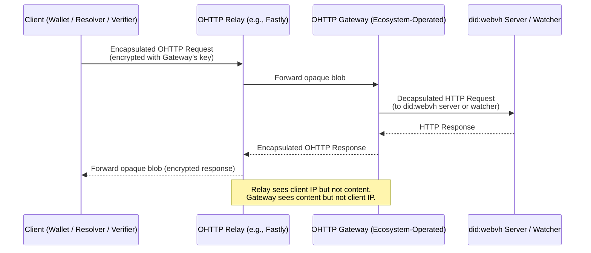

# did:webvh DID Method Work Item Rolling Agenda<!-- omit in toc -->

**Zoom Link**: [https://us02web.zoom.us/j/83119969275?pwd=IZTuXgGLtdLPjPLuB6q8zHXazxHSsU.1](https://us02web.zoom.us/j/83119969275?pwd=IZTuXgGLtdLPjPLuB6q8zHXazxHSsU.1)

**Agenda**: [did:webvh Info Site](https://didwebvh.info/latest/agenda/), [HackMD](https://hackmd.io/k4cIK9vQSlaeg2pdHE51IQ), [did:webvh Repository](https://github.com/decentralized-identity/didwebvh/blob/main/agenda.md) (synchronized after each meeting).

[**WG projects**](https://github.com/decentralized-identity?q=wg-cc&type=&language=) | [DIF page](https://identity.foundation/working-groups/claims-credentials.html) | [Mailing list and Wiki](https://lists.identity.foundation/g/cc-wg) | [Meeting recordings](https://docs.google.com/spreadsheets/d/1wgccmMvIImx30qVE9GhRKWWv3vmL2ZyUauuKx3IfRmA/edit?gid=111226877#gid=111226877)

## Table of Contents<!-- omit in toc -->

- [Meeting Information](#meeting-information)
- [Future Topics](#future-topics)
- [Later Meetings](#later-meetings)
- [Meeting - 18 Dec 2025](#meeting---18-dec-2025)
- [Meeting - 04 Dec 2025](#meeting---04-dec-2025)
- [Meeting - 20 Nov 2025](#meeting---20-nov-2025)
- [Meeting - 06 Nov 2025](#meeting---06-nov-2025)
- [Meeting - 23 Oct 2025](#meeting---23-oct-2025)
- [Meeting - 09 Oct 2025](#meeting---09-oct-2025)
- [Meeting - 25 Sept 2025](#meeting---25-sept-2025)
- [Meeting - 11 Sept 2025](#meeting---11-sept-2025)
- [Meeting - 28 Aug 2025](#meeting---28-aug-2025)
- [Meeting - 14 Aug 2025](#meeting---14-aug-2025)
- [Meeting - 31 Jul 2025](#meeting---31-jul-2025)
- [Meeting - 17 Jul 2025](#meeting---17-jul-2025)
- [Meeting - 03 Jul 2025](#meeting---03-jul-2025)
- [Meeting - 19 Jun 2025](#meeting---19-jun-2025)
- [Meeting - 05 Jun 2025](#meeting---05-jun-2025)
- [Meeting - 22 May 2025](#meeting---22-may-2025)
- [Meeting - 08 May 2025](#meeting---08-may-2025)
- [Meeting - 24 Apr 2025](#meeting---24-apr-2025)
- [Meeting - 10 Apr 2025](#meeting---10-apr-2025)
- [Meeting - 27 Mar 2025](#meeting---27-mar-2025)
- [Meeting - 13 Mar 2025](#meeting---13-mar-2025)
- [Meeting - 27 Feb 2025](#meeting---27-feb-2025)
- [Meeting - 13 Feb 2025](#meeting---13-feb-2025)
- [Meeting - 30 Jan 2025](#meeting---30-jan-2025)
- [Meeting - 16 Jan 2025](#meeting---16-jan-2025)
- [Prior Meetings](#prior-meetings)

## Meeting Information

- Before you contribute - **[join DIF]** and [sign the WG charter] (both are required!)
- Meeting Time: Every second Thursday at 9:00 Pacific (~=18:00 Central Europe)
- [Calendar entry]
- [ID WG participation tracking]
- [Zoom room]
- Links and Repositories:
    - [Specification], [Spec Repo], [Information Site]
    - Implementations: [TS], [Python], [Go], [Rust], [Server-Py]
    - Test Suite: [Test Suite]

_Participants are encouraged to turn your video on. This is a good way to build rapport across the contributor community._

_This document is live-edited DURING each call, and stable/authoritative copies live on our github repo under `/agenda.md`, link: [Agenda]._

[join DIF]: https://identity.foundation/join
[sign the WG charter]: https://bit.ly/DIF-WG-select1
[Calendar entry]: https://calendar.google.com/event?action=TEMPLATE&tmeid=NG5jYWowbmZsdWNzM21tYjBsbDIzdG50ZzFfMjAyNDA5MTJUMTYwMDAwWiBkZWNlbnRyYWxpemVkLmlkZW50aXR5QG0&tmsrc=decentralized.identity%40gmail.com&scp=ALL
[Zoom Room]: https://us02web.zoom.us/j/83119969275?pwd=IZTuXgGLtdLPjPLuB6q8zHXazxHSsU.1
[DIF Code of Conduct]: https://github.com/decentralized-identity/org/blob/master/code-of-conduct.md
[ID WG participation tracking]: https://docs.google.com/spreadsheets/d/12hFa574v5PRrKfzIKMgDTjxuU6lvtBhrmLspfKkN4oE/edit#gid=0
[operations@identity.foundation]: mailto:operations@identity.foundation
[did:webvh Specification license]: https://github.com/decentralized-identity/didwebvh/blob/main/LICENSE.md
[Agenda]: https://github.com/decentralized-identity/trustdidweb/blob/main/agenda.md
[Specification]: https://identity.foundation/didwevbvh
[Spec Repo]: https://github.com/decentralized-identity/didwebvh
[did:webvh AnonCreds Method]: https://identity.foundation/didwebvh/anoncreds-method/
[Information Site]: https://didwebvh.info
[Python]: https://github.com/decentralized-identity/didwebvh-py
[TS]: https://github.com/decentralized-identity/didwebvh-ts
[Go]: https://pkg.go.dev/github.com/nuts-foundation/trustdidweb-go
[Server-Py]: https://github.com/decentralized-identity/didwebvh-server-py
[Watcher-Py]: https://github.com/decentralized-identity/didwebvh-watcher-py
[Rust]: https://github.com/decentralized-identity/didwebvh-rs
[Affinidi Rust]: https://github.com/affinidi/affinidi-tdk-rs/tree/main/crates/affinidi-did-resolver/affinidi-did-resolver-methods/did-webvh
[Test Suite]: https://github.com/decentralized-identity/didwebvh-test-suite
[Implementations]: https://github.com/decentralized-identity/didwebvh-implementations
[did:webvh ACA-Py Plugin]: https://github.com/openwallet-foundation/acapy-plugins/tree/main/webvh
[Credo-TS]: https://github.com/openwallet-foundation/credo-ts
[did:webvh Static]: https://github.com/OpSecId/webvh-static
[did:webvh Tutorial]: https://didwebvh.info/latest/demos/understanding_didwebvh/
[DID Attested Resources]: https://identity.foundation/did-attested-resources
[DID Attested Resources Repository]: https://github.com/decentralized-identity/did-attested-resources

## Future Topics

- Using the `did:webvh` log format with other DID Methods
- Merging `did:webvh` features into `did:web`?

--------------------------------
## Later Meetings

Agendas for the current set of `did:webvh` Work Item meetings can be in the [Agenda] file.

[Agenda]: https://github.com/decentralized-identity/didwebvh/tree/main/agenda.md

## Meeting - 18 Dec 2025

Time: 9:00 Pacific / 17:00 Central Europe

Recording: [Zoom Recording and Chat Transcript](https://us02web.zoom.us/rec/share/vU8MQloh9kHdvwo04EsMwyL6yPLcmc2JqDGC_XobFo8tTPSK9xtPYLhjajU5YCSU.o3eRhDa5C67oRJ9v)

### To Do's from this Meeting (as generated by Zoom):<!-- omit in toc -->

1. Stephen: Add links to the spec and the series of messages from the CCG/W3CCG mailing list to the agenda or relevant documentation.
2. All: Continue discussion in chat regarding the application of did:cel traits to did:webvh and related implementation questions.
3. All: Have a great end of 2025 -- and a wonderful 2026.

### Agenda and Notes<!-- omit in toc -->

1. Welcome and Adminstrivia
    1. Recording on?
    2. Please make sure you: [join DIF], [sign the WG Charter], and follow the [DIF Code of Conduct]. Questions? Please contact [operations@identity.foundation].
    3. [did:webvh Specification license] -- W3C Mode
    4. Introductions and requests for additional Agenda Topics

2. Announcements:
    1. Hard stop today at 9:25 Pacific -- I have another meeting...
    2. did:cel announcement, spec and discussion.
    3. No meeting on Dec. 30, 2025.  Happy New Year! See you in 2026!

3. Status updates on the implementations
    1. [TS] -- 
    2. [Credo-TS] -- 
    3. [Python] -- 
    4. [Rust] -- 
    5. [Server-Py] -- higher level usage -- UI and client APIs
    6. [Watcher-Py] -- 
    7. [did:webvh AnonCreds Method] -- 
    8. [did:webvh ACA-Py Plugin] -- 
    9. [Test Suite] -- 
    10. [did:webvh Tutorial] -- 
    11. [Implementations] -- 

4. To Do's from Last Meeting:

    1. DONE Stephen: ping Steve Capell to see where DIA is and see whether it can be used
    2. Stephen: follow up on a couple of issues that are in the issues list
    3. DONE Stephen: have a session with Drummond next week in Victoria talking about location-independent DIDs


5. [PRs](https://github.com/decentralized-identity/didwebvh/pulls) to review

6. [Issues](https://github.com/decentralized-identity/didwebvh/issues) to review

7. Add did:cel features to did:webvh
   - Oblivious witness -- it's what we do, just need to remove that witness must see/verify the DID Log Entry before witnessing (unless it needs to).
   - Heartbeat -- Easy to add a "`heartbeat: <time>`" parameter, that commits the DID Controller and define what it means to a DID Resolver if that commit is missed (DID is deactivated per did:cel).
       - A heartbeat requires a log entry within a given period of time, and if not provided the DID is deactivated. Says nothing about what that log entry should be -- just must be an entry.
       - Separate topic -- should we allow an update WITHOUT a "`state`" value that implies "no change". If using pre-rotation? Other issues?  Other things to minimize space.
   - The discussion we had last week -- a did:webvh with no domain/path component -- just `did:webvh:<scid>`.

8. Open Discussion -- what else do you want to discuss?

## Meeting - 04 Dec 2025

Time: 9:00 Pacific / 17:00 Central Europe

Recording: [Zoom Recording and Chat Transcript](https://us02web.zoom.us/rec/share/MKxfwNPtwbGDMm995m71-m_Jv9VTaITKhLAECo13q1KVJ-E-GgIvWJPW0fPwjD7U.4ZdpkDvEn13wdJHp)

### To Do's from this Meeting (as generated by Zoom):<!-- omit in toc -->

1. Stephen: ping Steve Capell to see where DIA is and see whether it can be used
2. Stephen: follow up on a couple of issues that are in the issues list
3. Stephen: have a session with Drummond next week in Victoria talking about location-independent DIDs


### Agenda and Notes<!-- omit in toc -->

1. Welcome and Adminstrivia
    1. Recording on?
    2. Please make sure you: [join DIF], [sign the WG Charter], and follow the [DIF Code of Conduct]. Questions? Please contact [operations@identity.foundation].
    3. [did:webvh Specification license] -- W3C Mode
    4. Introductions and requests for additional Agenda Topics

2. Announcements:
    1. Demo of issuing/verifying did:webvh-rooted AnonCreds credentials using ACA-Py/Traction (issuer/verifier) and Credo-TS/Bifold Wallet in the public BC Wallet. w00t!! Lots of did:webvh Server upgrades to enable that, plus the creation of a Public Testing did:webvh server instance.

3. Status updates on the implementations
    1. [TS] -- 
    2. [Credo-TS] -- 
    3. [Python] -- 
    4. [Rust] -- 
    5. [Server-Py] -- Lots of updates
    6. [Watcher-Py] -- 
    7. [did:webvh AnonCreds Method] -- 
    8. [did:webvh ACA-Py Plugin] -- Lots of updates
    9. [Test Suite] -- 
    10. [did:webvh Tutorial] -- 
    11. [Implementations] -- 

4. To Do's from Last Meeting:

    1. DONE Stephen: Get the agenda PRs in
    2. Stephen: Take a look at the issue about including prior DIDs in `alsoKnownAs` of the DIDDoc and draft a PR on that one

5. [PRs](https://github.com/decentralized-identity/didwebvh/pulls) to review

6. [Issues](https://github.com/decentralized-identity/didwebvh/issues) to review

7. Is the did:webvh server trusted?
    - As trusted as the governance behind it?
    - Example: BC Gov has 4 instances:
        - Sandbox -- anyone can use it, reset 1st & 15th of the month.
        - Dev, Test, Prod -- published governance on who can publish to it. Could be trusted.
    - But can we make that visible and discoverable, with defined "Levels of Assurance" -- allowing for machine-readability?
    - With current implementation -- access the did:webvh server, with its configuration (list of witnesses, etc.) and a did:web.
        - How do you convey the server's did:webvh for determining trust given you only have the DID of the Issuer that is published on the server.
            - did:webvh server issues a credential to the DID. Contains the did:webvh DID, which can then be resolved, and its /whois checked.
            - Use the delegation possibility in DID Core to have the admin of the server manage its did:webvh server -- and issue credentials.

8. Topic: Should we add a location-less did:webvh to the specification? DID is just `did:webvh:<scid>`. The client resolving the DID must know how to resolve the DID, based on "context":

   - Benefits:
     - Could publish the identifier with a did:scid-like query parameter "`?src=<URL>`" that holds the location.
       - Should that just be the server location, or should it include "did.jsonl"?
         - Depends entirely on what the location is -- cheqd, HTTP, etc.
       - Any special ".well-known" handling needed?
     - Could be did:peer like and client finds DID Log in local storage.
     - Could be did:plc-like and everyone in an ecosystem "knows" where to get the DID Log location via an API lookup. A Watcher can be used for that -- although how that Watcher gets updates is TBD.
     - Others?
     - Value?
   - Argument against -- interop is harder. Loss of did:web simplicity.
   - Allows for other "DID methods" to use this log format and just adds how to find the DID Log -- on your favourite blockchain.

9. Open Discussion -- what else do you want to discuss?

## Meeting - 20 Nov 2025

Time: 9:00 Pacific / 17:00 Central Europe

Recording: Zoom Recording and Chat Transcript -- No Recording, as there were no topics to discuss.

### To Do's from this Meeting (as generated by Zoom):<!-- omit in toc -->

No To Do's created.

### Agenda and Notes<!-- omit in toc -->

1. Welcome and Adminstrivia
    1. Recording on?
    2. Please make sure you: [join DIF], [sign the WG Charter], and follow the [DIF Code of Conduct]. Questions? Please contact [operations@identity.foundation].
    3. [did:webvh Specification license] -- W3C Mode
    4. Introductions and requests for additional Agenda Topics

2. Announcements:
    1. 

3. Status updates on the implementations
    1. [TS] -- 
    2. [Credo-TS] -- 
    3. [Python] -- 
    4. [Rust] -- 
    5. [Server-Py] -- 
    6. [Watcher-Py] -- 
    7. [did:webvh AnonCreds Method] -- 
    8. [did:webvh ACA-Py Plugin] -- 
    9. [Test Suite] -- 
    10. [did:webvh Tutorial] -- 
    11. [Implementations] -- 

4. To Do's from Last Meeting:

    1. Stephen: Follow up on the issues that were not addressed from the last meeting
    2. DONE Stephen: Get the agenda PRs in
    3. Stephen: Take a look at the issue about including prior DIDs in `alsoKnownAs` of the DIDDoc and draft a PR on that one

5. [PRs](https://github.com/decentralized-identity/didwebvh/pulls) to review

6. [Issues](https://github.com/decentralized-identity/didwebvh/issues) to review

7. Open Discussion -- what else do you want to discuss?

## Meeting - 06 Nov 2025

Time: 9:00 Pacific / 17:00 Central Europe

Recording: [Zoom Recording and Chat Transcript](https://us02web.zoom.us/rec/share/2oHS1ZBGbI83XqrxmNRHaEnAM6Np4WXwhtH_ZnaUA7nAVnxh-gtO-N-bmXYxnqgI.5kzcAbd9s4wmiXJD)

### To Do's from this Meeting (as generated by Zoom):<!-- omit in toc -->

1. Stephen: Follow up on the issues that were not addressed from the last meeting
2. Stephen: Get the agenda PRs in
3. Stephen: Take a look at the issue about including prior values  and draft a PR on that one
4. Stephen and Patrick: Iterate on the "must" vs "should" requirement for prior values and have the discussion on the PR

### Agenda and Notes<!-- omit in toc -->

1. Welcome and Adminstrivia
    1. Recording on?
    2. Please make sure you: [join DIF], [sign the WG Charter], and follow the [DIF Code of Conduct]. Questions? Please contact [operations@identity.foundation].
    3. [did:webvh Specification license] -- W3C Mode
    4. Introductions and requests for additional Agenda Topics

2. Announcements:
    1. 

3. Status updates on the implementations
    1. [TS] -- 
    2. [Credo-TS] -- 
    3. [Python] -- 
    4. [Rust] -- 
    5. [Server-Py] -- Great progress - demonstrated during the call.
    6. [Watcher-Py] -- 
    7. [did:webvh AnonCreds Method] -- 
    8. [did:webvh ACA-Py Plugin] -- 
    9. [Test Suite] -- 
    10. [did:webvh Tutorial] -- 
    11. [Implementations] -- 

4. To Do's from Last Meeting:

    1. NOT POSSIBLE -- draft only -- not public yet - Stephen to add the link to the Government of Canada document about digital trust guidance that includes DIDWebVH.
    2. NOT DONE - Stephen to respond to Vasily's issue from Switzerland regarding the implementer's Guide and consistency with the spec.
    3. NOT DONE - Stephen to prepare for discussion about changes to the DIDWebVH spec due to changes in the core spec/DID resolution spec for the next meeting.
    4. NOT DONE - Stephen to share the VLEI DidWeb tests/Jupyter Notebook with Patrick.
    5. NOT DONE - Stephen and Patrick to brainstorm and develop educational tools similar to the Jupyter Notebook for DIDWebVH.
    6. DONE - Patrick to continue work on getting the Credo TS implementation into the BC Wallet to handle DIDWebVH DIDs.

5. [PRs](https://github.com/decentralized-identity/didwebvh/pulls) to review

6. [Issues](https://github.com/decentralized-identity/didwebvh/issues) to review

7. Patrick St. Louis and progress on the did:webvh server.
    1. Demo and discussion

8. Impact of new DID Path processing rules on did:webvh.

9. Open Discussion -- what else do you want to discuss?

## Meeting - 23 Oct 2025

Time: 9:00 Pacific / 17:00 Central Europe

Recording: [Zoom Recording and Chat Transcript](https://us02web.zoom.us/rec/share/9MiOWQV0-TDD5aJn3SkZ1jZ0cCwRIg7XfKYzte6aqq-DZ6jnFX1vTXJOf1Z4fuCU.O5DsvN-eX_Pt1Tv1)

### To Do's from this Meeting (as generated by Zoom):<!-- omit in toc -->

1. Stephen to add the link to the Government of Canada document about digital trust guidance that includes DIDWebVH.
2. Stephen to respond to Vasily's issue from Switzerland regarding the implementer's Guide and consistency with the spec.
3. Stephen to prepare for discussion about changes to the DIDWebVH spec due to changes in the core spec/DID resolution spec for the next meeting.
4. Stephen to share the VLEI DidWeb tests/Jupyter Notebook with Patrick.
5. Stephen and Patrick to brainstorm and develop educational tools similar to the Jupyter Notebook for DIDWebVH.
6. Stephen to tag meeting participants in the notes so they can check the latest implementation status updates.
7. Patrick to continue work on getting the Credo TS implementation into the BC Wallet to handle DIDWebVH DIDs.

### Attendees:<!-- omit in toc -->

- Stephen Curran
- Makki
- Carly
- Ivan

### Agenda and Notes<!-- omit in toc -->

1. Welcome and Adminstrivia
    1. Recording on?
    2. Please make sure you: [join DIF], [sign the WG Charter], and follow the [DIF Code of Conduct]. Questions? Please contact [operations@identity.foundation].
    3. [did:webvh Specification license] -- W3C Mode
    4. Introductions and requests for additional Agenda Topics

2. Announcements:
    1. Government of Canada includes did:webvh in their Digital Trust guidance.
    2. DID Working Group adjusting DID URL path resolution handling

3. Status updates on the implementations
    1. [TS] -- 
    2. [Credo-TS] -- 
    3. [Python] -- 
    4. [Rust] -- 
    5. [Server-Py] -- Awesome progress on the UI and performance.
    6. [Watcher-Py] -- 
    7. [did:webvh AnonCreds Method] -- 
    8. [did:webvh ACA-Py Plugin] -- 
    9. [Test Suite] -- 
    10. [did:webvh Tutorial] -- 
    11. [Implementations] -- 

4. To Do's from Last Meeting:

    1. DONE Stephen to write up the proposal for path handling in DID Resolution spec based on the discussion.
    2. DONE Stephen to reach out to other stakeholders about the path handling proposal before creating a PR.
    3. DONE Stephen to create a PR for the DID Resolution spec to include the path handling proposal.
    4. TO DO Stephen to put a note on LinkedIn about did:webvh becoming officially DIF-recommended.
    5. DONE Brian to follow up with Patrick about the schema name, version, and cred def tag exposure in Credo, Bifold Wallet, and BC wallet.


5. [PRs](https://github.com/decentralized-identity/didwebvh/pulls) to review

6. [Issues](https://github.com/decentralized-identity/didwebvh/issues) to review

7. Open Discussion -- what else do you want to discuss?

## Meeting - 09 Oct 2025

Time: 9:00 Pacific / 17:00 Central Europe

Recording: [Zoom Recording and Chat Transcript](https://us02web.zoom.us/rec/share/wjgxiIcsQSEvxlGD-DhJbY3N-J4xxCMcR0eLJwTyINqt66iatrjOUWRmKafB2IFT.637lSjKcNfJZQWRS)

### To Do's from this Meeting (as generated by Zoom):<!-- omit in toc -->

1. Stephen to write up the proposal for path handling in DID Resolution spec based on the discussion.
2. Stephen to reach out to other stakeholders about the path handling proposal before creating a PR.
3. Stephen to create a PR for the DID Resolution spec to include the path handling proposal.
4. Stephen to put a note on LinkedIn about did:webvh becoming officially DID recommended.
5. Brian to follow up with Patrick about the schema name, version, and cred def tag exposure in Credo, Bifold Wallet, and BC wallet.

### Attendees:<!-- omit in toc -->

- Stephen Curran
- Brian Richter
- Dmitri Zagidulin
- Patrick St. Louis


### Agenda and Notes<!-- omit in toc -->

1. Welcome and Adminstrivia
    1. Recording on?
    2. Please make sure you: [join DIF], [sign the WG Charter], and follow the [DIF Code of Conduct]. Questions? Please contact [operations@identity.foundation].
    3. [did:webvh Specification license] -- W3C Mode
    4. Introductions and requests for additional Agenda Topics

2. Announcements:
    1. The DID Methods Standardization Working Group has made did:webvh a "DIF Recommended" [via this PR](https://github.com/decentralized-identity/did-methods/pull/67). Comments and objections were collected for 60 days, through September 28, 2025 and no objections were received.
    2. ACA-Py User Group meeting this Tuesday will cover the publication of did:webvh DIDs and AnonCreds resources from ACA-Py with Endorsement. Link to agenda to be added.

3. Status updates on the implementations
    1. [TS] -- 
    2. [Credo-TS] -- PR in Bifold to handle AnonCreds Schema/CredDef names. Might need more work.
    3. [Python] -- 
    4. [Rust] -- 
    5. [Server-Py] -- Explorer sped up -- database of DIDs and resources created.
    6. [Watcher-Py] -- 
    7. [did:webvh AnonCreds Method] -- 
    8. [did:webvh ACA-Py Plugin] -- 
    9. [Test Suite] -- 
    10. [did:webvh Tutorial] -- 
    11. [Implementations] -- 

4. To Do's from Last Meeting:

    1. DONE - Patrick to optimize the storage and performance of the DidWebVH Explorer.
    2. Patrick to implement a function in did-webvh-python that prunes witness files based on logs.
    3. DONE - Brian to investigate caching schema names in the wallet to improve credential display performance.
    4. DONE - Brian to continue working on the AnonCreds resources for Credo registration.
    5. DONE - Stephen to close the benchmark issue related to did-webvh.
    6. Team to update an OCA bundle to include the identifier once the sandbox is up.
    7. DONE (Issue added) - Team to explore implementing Oblivious HTTP in did-webvh resolvers.

5. No [PRs](https://github.com/decentralized-identity/didwebvh/pulls) to review

6. No new [Issues](https://github.com/decentralized-identity/didwebvh/issues) to review

7. DID URL Path Resolution -- want to talk about it? Yes!
    - Fragments -- handle the same as HTTP -- client deals with the resolved resource and content type.
    - Path -- `<did>/path/to/resource`
      - left to each DID method
      - Goal: Path resolved through a storage system mechanism
      - High level approach -- look in the services section -- under the appropriate types use that as the base.
      - Cascading fallback algo:
          - Use Cases:
              - One storage service -- one path `<serviceEndpoint>/path/to/file`
          - What if there are multiple?
              - Current -- use a query parameter to point to a specific service. `service='<id?'`
              - Could we use a `prefix` notation? Use the path to determine the right service, and the type of the service to define the serviceEndpoint handling.
                  - `prefix`: '<did>/googledrive/path/to/file'
                  - `prefix`: '/dropbox/'
          - The `whois` use case doesn't work with the above.  Instead, what about a query parameter `/whois`?
              - Could we use the matches on prefix and service type?
    
**Redirection Algorithm for DID URL Paths**

Given a DID URL of the form <did>/path/to/file, perform the following steps to resolve it to a target resource via service redirection:

1.  **Extract the Path** 
    
    Extract the _path_ component from the DID URL (e.g., /path/to/file).
    
2.  **Identify Matching Services** 
    
    From the DID Document, find all services that include a prefix property. For each such service:
    
    -   Check if the DID URL path starts with the service’s prefix value.
    -   Keep all services where this is true.

3.  **Select the Best Match** 
    
    From the matching services:
    
    -   Select the service with the **longest matching prefix** (i.e., the most specific match).        
    
4.  **Construct the Redirect URL** 
    
    -   Remove the matching prefix from the start of the DID URL path.
        
    -   Append the remainder to the serviceEndpoint of the selected service, ensuring appropriate URL concatenation.
    
    - Question: Should we allow for service `type` specific processing in assembling/resolving the `serviceEndpoint`.
        
    
5.  **Resolve the Target** 
    
    -   Resolve the resulting URL.
        
    -   Return the resolved resource and associated metadata.
        

---

**Notes:**

-   Matching is literal, case-sensitive, and must be prefix-based (e.g., /docs matches /docs/file.txt but not /documents/file.txt).
    
-   If no service matches, the DID URL is not redirected and may resolve to the DID Document or be treated as an error.
    
-   This algorithm assumes the serviceEndpoint is an HTTP(S) URL or another resolvable resource reference.

```json
services: [
  { 
      id: '...',
      type: 'FileService',
      prefix: '/',
      serviceEndpoint: 'https://my.storage.example/files/'
   }
]

```

For `<did>/whois`, the prefix matches the entire path, so an empty string is appended to the serviceEndpoint, so the serviceEndpoint is the full URL of the verifiable presentation.

```json
services: [
  {
     id: 'my-whois-service',
     prefix: '/whois',
     type: 'WhoisService',
     serviceEndpoint: 'https://server/path/to/whois.vp'
  }
]
```

8. Open Discussion -- what else do you want to discuss?

## Meeting - 25 Sept 2025

Time: 9:00 Pacific / 17:00 Central Europe

Recording: [Zoom Recording and Chat Transcript](https://us02web.zoom.us/rec/share/YmpNL8SOoWZxsrkLDVAnYercy-jIOJ9eiukQrFUsbTnTXvcF17EqxJqe7sTa5Iex.IyJaNLb1tqTCQlwr)

### To Do's from this Meeting (as generated by Zoom):<!-- omit in toc -->

1. Patrick to optimize the storage and performance of the DidWebVH Explorer.
2. Patrick to implement a function in did-webvh-python that prunes witness files based on logs.
3. Brian to investigate caching schema names in the wallet to improve credential display performance.
4. Brian to continue working on the Anon Creds resources for Credo registration.
5. Stephen to close the benchmark issue related to did-webvh.
6. Team to update an OCA bundle to include the identifier once the sandbox is up.
7. Team to explore implementing Oblivious HTTP in did-webvh resolvers.

### Attendees:<!-- omit in toc -->

- Stephen Curran
- Brian Richter
- Dmitri Zagidulin
- Alexander Shenshin
- Patrick St. Louis

### Agenda and Notes<!-- omit in toc -->

1. Welcome and Adminstrivia
    1. Recording on?
    2. Please make sure you: [join DIF], [sign the WG Charter], and follow the [DIF Code of Conduct]. Questions? Please contact [operations@identity.foundation].
    3. [did:webvh Specification license] -- W3C Mode
    4. Introductions and requests for additional Agenda Topics

2. Announcements:
    1. Presentation about did:webvh and [DID Attested Resources] planned for September 15, 2025 at the OpenWallet Foundation's Wallet Interoperability SIG. Meeting Agenda and Zoom Link [here](https://lf-openwallet-foundation.atlassian.net/wiki/spaces/GROUP/pages/221970474/2025-09-15+Wallet+Interop+SIG). [Recording](https://zoom.us/rec/share/odK9dUKf8wVNKpDiHFvJ_vqHXYwKLszrUxagccibLIN7xwWOhXTFjTqQhgU_QPJF.wlVcop5Kx6DSSmeZ), [Slides](https://docs.google.com/presentation/d/14bgzrU-o035LBnejNm-wHq863ZFXINe4MUokfm4G0vM/edit?slide=id.p#slide=id.p).
    2. NEW! -- did:webvh Explorer added to the did:webvh [Server-Py]! Checkout [https://demo.identifier.me/explorer](https://demo.identifier.me/explorer) as an example. Awesome work by @PatStLouis!
    3. Update to [Rust] implementation -- 0.1.6. New dependencies to improve integration, updates to the Wizard (e.g. automated did:web generation), more automated tests (74.27% coverage) and more!
    4. Reminder: The DID Methods Standardization Working Group [PR to make did:webvh "DIF Recommended"](https://github.com/decentralized-identity/did-methods/pull/67) has been published. Comments and objections will be collected for 60 days, through September 28, 2025. Please keep an eye on the PR.

3. Status updates on the implementations
    1. [TS] -- demo of [did:webvh-rooted AnonCreds VCs used in BC Wallet](https://www.youtube.com/watch?v=8MBxhJ-7XR4). Yay!!!
    2. [Credo-TS] -- Support for did:webvh AnonCreds registration being implemented via [this PR](https://github.com/openwallet-foundation/credo-ts/pull/2396) for the main banch and [this PR](https://github.com/openwallet-foundation/credo-ts/pull/2419) for the 0.5.x branch.
    3. [Python] -- to do -- adding a function to prune the witness file given a DID Log and set of witness proofs.
    4. [Rust] -- 
    5. [Server-Py] -- 
    6. [Watcher-Py] -- 
    7. [did:webvh AnonCreds Method] -- 
    8. [did:webvh ACA-Py Plugin] -- PR streamlines the DID operations for update and deactivation. Enables use of DID for the DIDComm channel -- copying from the Cheqd implementation, and may help an issue happening with did:web.
    9. [Test Suite] -- 
    10. [did:webvh Tutorial] -- 
    11. [Implementations] -- 

4. To Do's from Last Meeting:

    1. DONE Stephen to merge the PR about deactivation after addressing Brian's comment about empty objects.
    2. NOT DONE Stephen to raise issues in the DID WebVH spec and DID resolution spec regarding deactivation behavior and version parameters.
    3. DONE Stephen to prepare for the Open Wallet Foundation presentation on Monday, September 15th.
    4. NO PROGRESS Stephen to investigate submiting the DID WebVH Explorer as a demo for TPAC following W3C's request.
    5. DONE Stephen to review and merge Patrick's PR for the DID WebVH Explorer.
    6. NO PROGRESS Stephen to clean up the spec and address the index of normative references.
    7. IN PROGRESS Brian to support work on the registrar set of AnonCreds resources for Credo implementation.

5. [PRs](https://github.com/decentralized-identity/didwebvh/pulls) Review
    - Discuss and merge if possible.

6. Other [Issues](https://github.com/decentralized-identity/didwebvh/issues) Review
    - Discuss and close as possible.
    - Notes...

7. Question from Tim Bloomfield about [Oblivious HTTP](https://www.ietf.org/rfc/rfc9458.html) -- is there something we could do in the spec or implementation tools to enable support.

`<tl;dr>` Oblivious HTTP (OHTTP) is standardized and minimized TOR-like capability where a Client sends a request to a Server through an OHTTP Relay to a Gateway, and gets the response back along the reverse path. Neither the Gateway nor the Server learn who sent the request, and the Relay doesn't know where the request went. The request/response are encrypted using TLS between the client and server -- hidden from the Relay and Gateway.

In practice, OHTTP is used for sessionless queries, such as for the Google Safe Browsing List and Firefox's Browser Telemetry data collection. A did:webvh server or watchers are good candidates for this capability.



Discuss...
* Good idea -- could be in the privacy section as a mitigation -- guidance.
* Relevant more to the implementations -- try testing it out and see about how this works.  Could be done in resolvers so we can see the speed/privacy tradeoff.

8. Open Discussion -- what else do you want to discuss?

## Meeting - 11 Sept 2025

Time: 9:00 Pacific / 17:00 Central Europe

Recording: [Zoom Recording and Chat Transcript](https://us02web.zoom.us/rec/share/GAneCYilJNC2SRTSOPyFADk39X_dCrc8rWLj9OpuPIsTLMUAPx511g2MLawhZM0.NWYjBqrqDjxUSXMR)

### To Do's from this Meeting (as generated by Zoom):<!-- omit in toc -->

1. Stephen to merge the PR about deactivation after addressing Brian's comment about empty objects.
2. Stephen to raise issues in the DID WebVH spec and DID resolution spec regarding deactivation behavior and version parameters.
3. Stephen to prepare for the Open Wallet Foundation presentation on Monday, September 15th.
4. Stephen to investigate submiting the DID WebVH Explorer as a demo for TPAC following W3C's request.
5. Stephen to review and merge Patrick's PR for the DID WebVH Explorer.
6. Stephen to clean up the spec and address the index of normative references.
7. Brian to support work on the registrar set of AnonCreds resources for Credo implementation.

### Attendees:<!-- omit in toc -->

- Stephen Curran
- Brian Richter
- Dmitri Zagidulin
- Alexander Shenshin
- Philip Long

### Agenda and Notes<!-- omit in toc -->

1. Welcome and Adminstrivia
    1. Recording on?
    2. Please make sure you: [join DIF], [sign the WG Charter], and follow the [DIF Code of Conduct]. Questions? Please contact [operations@identity.foundation].
    3. [did:webvh Specification license] -- W3C Mode
    4. Introductions and requests for additional Agenda Topics

2. Announcements:
    1. Presentation about did:webvh and [DID Attested Resources] planned for September 15, 2025 at the OpenWallet Foundation's Wallet Interoperability SIG. Meeting Agenda and Zoom Link [here](https://lf-openwallet-foundation.atlassian.net/wiki/spaces/GROUP/pages/221970474/2025-09-15+Wallet+Interop+SIG).
    2. NEW! -- did:webvh Explorer added to the did:webvh [Server-Py]! Checkout [https://demo.identifier.me/explorer](https://demo.identifier.me/explorer) as an example. Awesome work by @PatStLouis!
    3. Update to [Rust] implementation -- 0.1.6. New dependencies to improve integration, updates to the Wizard (e.g. automated did:web generation), more automated tests (74.27% coverage) and more!
    4. Reminder: The DID Methods Standardization Working Group [PR to make did:webvh "DIF Recommended"](https://github.com/decentralized-identity/did-methods/pull/67) has been published. Comments and objections will be collected for 60 days, through September 28, 2025. Please keep an eye on the PR.

3. Status updates on the implementations
    1. [TS] -- Credo 0.5.17 released. All of the resolution things are there. Working on the registrar of AnonCreds objects and pushing updates into Bifold/BC Wallet.
    2. [Python] -- 
    3. [Rust] -- See notes above about 0.1.6.
    4. [Server-Py] -- New Explorer added.
    5. [Watcher-Py] -- 
    6. [did:webvh AnonCreds Method] -- 
    7. [did:webvh ACA-Py Plugin] -- 
    9. [Test Suite] -- 
    9. [did:webvh Tutorial] -- 
    10. [Implementations] -- 

4. To Do's from Last Meeting:

    1. DONE - The group to present about DID WebVH and DID Attested Resources at the Open Wallet Foundation's Wallet Interoperability SIG meeting on September 15th.
    2. SCHEDULED for 2026.02.17 (!!) - The group to prepare a presentation for the CCG about WebVH, attested resources, and the topic of default service in DIDs.
    3. Patrick to explore making the witness file a service in the DID WebVH specification.
    4. DONE - Stephen to review Glenn's comments on the deactivate session pull request.
    5. Stephen to consider potential unwanted effects of portability on the deactivation methods.
    6. Patrick to try implementing verification of credentials with past rotated keys in ACA-Py to test if it works with query parameters -- e.g. a DID of the form `<did>?versionId=<id>#keyid`.

5. Question from Glenn about the definition in the did:webvh spec about the `/whois` service. Is it valid that the `id` is a relative ref (just `#whois`) or does it need to be `<did>#whois`? The DID Core Spec clearly supports this -- see [Relative DID URLs](https://www.w3.org/TR/did/upcoming/#relative-did-urls) section. But what about interop?
    - We can add to the spec "may use an absolute reference" to the implict definitions of the two services.

6. [PRs](https://github.com/decentralized-identity/didwebvh/pulls) Review
    - Discuss and merge if possible.

7. Other [Issues](https://github.com/decentralized-identity/didwebvh/issues) Review
    - Discuss and close as possible.
    - Notes...

8. Open Discussion -- what else do you want to discuss?
    9. Consider submitting for a TPAC Demo the did:webvh explorer


## Meeting - 28 Aug 2025

Time: 9:00 Pacific / 17:00 Central Europe

Recording: [Zoom Recording and Chat Transcript](https://us02web.zoom.us/rec/share/o_w_urSYWHSueKJHr2Pfzjr2lpfc8T4WpiZ33A7nB67R5ak1iIJU8XfnjdSGM7jh.ORVKxUQq33PPncPe)

### To Do's from this Meeting (as generated by Zoom):<!-- omit in toc -->

1. The group to present about DID WebVH and DID Attested Resources at the Open Wallet Foundation's Wallet Interoperability SIG meeting on September 15th.
2. The group to prepare a presentation for the CCG about WebVH, attested resources, and the topic of default service in DIDs.
3. Patrick to explore making the witness file a service in the DID WebVH specification.
4. Stephen to review Glenn's comments on the deactivate session pull request.
5. Stephen to consider potential unwanted effects of portability on the deactivation methods.
9. Patrick to try implementing verification of credentials with past rotated keys in ACA-Py to test if it works with query parameters -- e.g. a DID of the form `<did>?versionId=<id>#keyid`.

### Attendees:<!-- omit in toc -->

- Stephen Curran
- Patrick St. Louis
- Dmitri Zagidulin
- Alexander Shenshin
- Philip Long

### Agenda and Notes<!-- omit in toc -->

1. Welcome and Adminstrivia
    1. Recording on?
    2. Please make sure you: [join DIF], [sign the WG Charter], and follow the [DIF Code of Conduct]. Questions? Please contact [operations@identity.foundation].
    3. [did:webvh Specification license] -- W3C Mode
    4. Introductions and requests for additional Agenda Topics

2. Announcements:
    1. Presentation about did:webvh and DID Attested Resources planned for September 15, 2025 at the OpenWallet Foundation's Wallet Interoperability SIG. Meeting Agenda and Zoom Link [here](https://lf-openwallet-foundation.atlassian.net/wiki/spaces/GROUP/pages/221970474/2025-09-15+Wallet+Interop+SIG).
    2. [DID Attested Resources] specification has been created.
    3. Reminder: The DID Methods Standardization Working Group [PR to make did:webvh "DIF Recommended"](https://github.com/decentralized-identity/did-methods/pull/67) has been published. Comments and objections will be collected for 60 days, through September 28, 2025. Please keep an eye on the PR.

3. Status updates on the implementations
    1. [TS] -- Credo evolution continues -- possibly done, needs to be pulled into Bifold, and then the BC Wallet PR updated.
    2. [Python] -- is at 1.0 -- published.  The "none" handling has been included.
    3. [Rust] -- Updated with recent feedback to the wizard and clarifications.
    4. [Server-Py] -- Deployed the BC Gov Sandbox of the Server-Py. Anyone can use it for test DIDs.
    5. [Watcher-Py] -- 
    6. [did:webvh AnonCreds Method] -- 
    7. [did:webvh ACA-Py Plugin] -- 
    9. [Test Suite] -- 
    9. [did:webvh Tutorial] -- 
    10. [Implementations] -- 

4. To Do's from Last Meeting:

    1. DONE - Brian to complete Patrick's PR for both the 06 and 05 branches
    2. DONE - Patrick to open the PR for Python 1.0 release with null parameter changes this afternoon
    3. DONE - Patrick to ping Andrew for review on the Python PR
    4. IN PROGRESS - Andrew to review the Askar Issue -- request for a new version
    5. DONE - Stephen to add a note in the security section about avoiding reuse of update keys

5. New spec -- [DID Attested Resources] ([DID Attested Resources Repository]) has been created at DIF and we'll start to circulate it. Once it is close enough, we'll update the [did:webvh AnonCreds Method] to reference the new spec instead of embedding it. Feedback welcome.

    - Question from Dmitri -- how does did:webvh only use a path on the DID using `relativeRef` without including a query parameter that references the (implicit or explicit) service.  Stephen to add a DID Resolution issue to request that there is **one** way to define the base of a DID URL. We should have a session with the CCG/DID Working Group on this topic.
    - Patrick would like to remove "DID" from the name as it is able to be used with DIDs and other controlled identifiers.

6. The concept of a "location-less" `did:webvh` (from chat on Signal) -- making the server location optional, and if not provided, the resolver (or client of the resolver) is assumed to know from context (e.g. outside the specification -- left to governance) where to find the DID Log and witness files. This is an alternate to did:scid, mostly because I don't understand did:scid, and why it is better than achieving the same goals with just `did:webvh`.

Potential uses:

- An alternative to did:peer for peer DIDs. Requires that the distribution of the DID Log by handle.
- Useful as a replacement for did:plc, where the location of the DIDs are "known" and accessed via an API.
- An ecosystem with well known watchers.
- Location can be in a query parameter, e.g. `<did>?src=<DID Log URL>` 

ASIDE: Dmitri/Patrick super clever idea -- make the "witness.json" referenced by a service in the DIDDoc. An implicit service that you can override. Issue to be added to the `did:webvh` repo. Issue to be added to the spec for a future version.

A suggestion was made that this might be a separate spec / DID Method because it would change a lot in the spec. However, I would argue the reverse -- that it would change very little in the spec, and separating it out would duplicate almost the entire spec. The only thing we are changing is the removal of the "discovery" method for the spec, and adding a note -- if there is no location in the spec, it is up to the resolver to know where to get the DID Log File, which is out of scope of the spec.  We might add the query parameter method as an alternative. 

7. [PRs](https://github.com/decentralized-identity/didwebvh/pulls) Review
    - Discuss and merge if possible.
    - Re: [Deactivation PR 252](https://github.com/decentralized-identity/didwebvh/pull/252)
        - Still need to review more Glenn's comments, but they are more at the DID Resolution level than at the DID Method level. Patrick mentioned about how partability might impact deactivation.
        - This led to an interesting discussion about the need to differentiate between why a key has been detactivated -- rotation but signatures valid vs. compromised -- don't trust, and making it easier to directly find past keys with status metadata without having to include them in the current DIDDoc. Issue to be added to the did:webvh spec and to be raised at the DID Resolution level.

8. NOT COVERED - OUT OF TIME: Other [Issues](https://github.com/decentralized-identity/didwebvh/issues) Review
    - Discuss and close as possible.
    - Notes...

9. Open Discussion -- what else do you want to discuss?

## Meeting - 14 Aug 2025

Time: 9:00 Pacific / 17:00 Central Europe

Recording: [Zoom Recording and Chat Transcript](https://us02web.zoom.us/rec/share/M5rG6ehIZsZVf1-eaOoBvxS-ozSZnPlSRGqEgY88c0WDMtWbaY5rt6SpFnDF4_xI.IcGXL4VZDEPR5S8T)

### To Do's from this Meeting (as generated by Zoom):<!-- omit in toc -->

1. Brian to complete Patrick's PR for both the 06 and 05 branches
2. Patrick to open the PR for Python 1.0 release with null parameter changes this afternoon
3. Patrick to ping Andrew for review on the Python PR
4. Andrew to review the Askar Issue -- request for a new version
5. Stephen to add a note in the security section about avoiding reuse of update keys

### Attendees:<!-- omit in toc -->

- Stephen Curran
- Brian Richter
- Patrick St. Louis
- Andrew Whitehead
- Venu R
- Philip Long
- Alexander Shenshin

### Agenda and Notes<!-- omit in toc -->

1. Welcome and Adminstrivia
    1. Recording on?
    2. Please make sure you: [join DIF], [sign the WG Charter], and follow the [DIF Code of Conduct]. Questions? Please contact [operations@identity.foundation].
    3. [did:webvh Specification license] -- W3C Mode
    4. Introductions and requests for additional Agenda Topics

2. Announcements:
    1. Affinidi has contributed their did:webvh Rust implementation to DIF and is now the official [Rust] implementation.
    2. The DID Methods Standardization Working Group [PR to make did:webvh "DIF Recommended"](https://github.com/decentralized-identity/did-methods/pull/67) has been published. Comments and objections will be collected for 60 days, through September 28, 2025. Please keep an eye on the PR.

3. Status updates on the implementations
    1. [TS] -- Credo PRs merged, but a problem with Attested Resources was found and is being fixed. React Native tweak done to simplify including in BC Wallet.
    2. [Python] -- 1.0 Release pending -- with `null` parameter handling changes made.
    3. [Rust] -- is now the Affinidi implementation.
    4. [Server-Py] -- deployed to the BC Gov Traction sandbox with an Endorser and policies. Along with the plug.
    5. [Watcher-Py] -- 
    6. [did:webvh AnonCreds Method] -- 
    7. [did:webvh ACA-Py Plugin] -- Updated with the [Server-Py] component and deployed with Traction
    9. [Test Suite] -- 
    9. [did:webvh Tutorial] -- 
    10. [Implementations] -- 

4. To Do's from Last Meeting:

    1. TO DO: Patrick to open an issue to review the witness logic and code in the Python implementation to match the latest changes to the spec, clarifying that an empty dictionary for witness means it's deactivated.
    2. DONE: Patrick to address the review comments on the server watcher plugin for deployment in the sandbox environment.
    3. TO DO: Stephen to add a note in the deactivate section regarding the deactivation of a DID and its implications on resolution.
    4. TO DO: Stephen to include guidance on deactivation in the DID resolution spec, mentioning the state being empty and returning a "not found" status.
    5. DONE: Stephen to add an issue regarding the crypto suite discussion and defer it for a version 2 discussion.
    6. DONE: Stephen to check the status of did:webvh's acceptance on a standards track for W3C.
    7. TO DO: Stephen to propose another presentation about did:webvh at the CCG to update folks about the comment period.
    8. TO DO: Patrick to follow up with UNTP about their interest in implementing did:webvh.


5. [PRs](https://github.com/decentralized-identity/didwebvh/pulls) Review
    1. Discuss and merge if possible.
    2. PRs merged, except the security and privacy one (new). More changes pending on that after the meeting.

6. Question from Victor Dods. If there is more than one entry in the `updateKeys` what happens if you have two keys used to make different parallel updates to the DID? (From this [issue comment](https://github.com/decentralized-identity/did-methods/pull/67#issuecomment-3177377431)).
    1. Separate out the two cases of malicious vs. accidental.
        1. Accidental. Mitigations:
            1. did:webvh server could detect and prevent.
            2. did:webvh witnesses would detect and prevent.
            3. did:webvh watchers would detect and prevent.
        2. Malicious.
            1. Loss of key -- mitigation is the use of pre-rotation.
            2. All of the other mitigations apply, but in a different way -- detecting an invalid update.

7. Question from Victor Dods as [issue #246](https://github.com/decentralized-identity/didwebvh/issues/246) explicitly address in the spec that a DID Controller should not reuse an update / pre-rotation key.
    1. Discussed and agreed we should add a note recommending against doing so in line with key handling best practices, but there is not a requirement for the resolver to track/detect/invalidate the DID if that is done. A resolver can do that, but not required.

8. Other [Issues](https://github.com/decentralized-identity/didwebvh/issues) Review
    1. Issues reviewed, some closed based on the PRs merged earlier in the meeting.

9. Open Discussion -- what else do you want to discuss?

## Meeting - 31 Jul 2025

Time: 9:00 Pacific / 17:00 Central Europe

Recording: [Zoom Recording and Chat Transcript](https://us02web.zoom.us/rec/share/isyq9fNccp34xIeTMx2OVZZRmVvFFYYeF7LjdfYVe_ZQ9qCJwGS5Im4vZNv2KvFX.5YOVP6UzGxdyB4y7)

### To Do's from this Meeting (as generated by Zoom):<!-- omit in toc -->

1. Patrick to open an issue to review the witness logic and code in the Python implementation to match the latest changes to the spec, clarifying that an empty dictionary for witness means it's deactivated.
2. Patrick to address the review comments on the server watcher plugin for deployment in the sandbox environment.
3. Stephen to add a note in the deactivate section regarding the deactivation of a DID and its implications on resolution.
4. Stephen to include guidance on deactivation in the DID resolution spec, mentioning the state being empty and returning a "not found" status.
5. Stephen to add an issue regarding the crypto suite discussion and defer it for a version 2 discussion.
6. Stephen to check the status of did:webvh's acceptance on a standards track for W3C.
7. Stephen to propose another presentation about did:webvh at the CCG to update folks about the comment period.
8. Patrick to follow up with UNTP about their interest in implementing did:webvh.

### Attendees:<!-- omit in toc -->

- Stephen Curran
- Brian Richter
- Patrick St. Louis
- Phil

### Agenda and Notes<!-- omit in toc -->

1. Welcome and Adminstrivia
    1. Recording on?
    2. Please make sure you: [join DIF], [sign the WG Charter], and follow the [DIF Code of Conduct]. Questions? Please contact [operations@identity.foundation].
    3. [did:webvh Specification license] -- W3C Mode
    4. Introductions and requests for additional Agenda Topics

2. Announcements:
    1. Affinidi has agreed to contribute their did:webvh Rust implementation to DIF. It will replace the existing `https://github.com/decentralized-identity/didwebvh-rs` repo. The current implementation will be renamed and archived.
    2. Second did:webvh Deep Dive completed at DIF/W3C DID Methods Standardization Working Group -- [recording](https://us02web.zoom.us/rec/share/lfV6HHLI9JrbIihvji3aChwKMzpKNuAYstXwHjcAAXbBI6pt1e1GTGheEY-vR0G6.xRejirZnUaAxQB3_), [slides](https://docs.google.com/presentation/d/19mm6hFbyd0GNQ652A7VMkXgi2thxBe29rsUtPTUakpM/edit?usp=sharing).

3. Status updates on the implementations
    1. [TS] -- Credo-TS PR Update and ready for review.
    2. [Python] -- 
    3. [Rust] -- To Be Archived and replaced with the Affinidi implementation.
    4. Affinidi Rust -- being prepared for contribution to DIF.
    5. [Server-Py] -- 
    6. [Watcher-Py] -- 
    7. [did:webvh AnonCreds Method] -- 
    8. [did:webvh ACA-Py Plugin] -- 
    9. [Test Suite] -- 
    10. [did:webvh Tutorial] -- 
    11. [Implementations] -- 

4. To Do's from Last Meeting:

    1. DONE - Stephen to update the spec with weasel words to keep it at version 1.0 while addressing the changes discussed.
    2. DONE - Stephen to add clarification to the spec that a DID cannot fall back to a previous version.
    3. DONE - Stephen to update the spec regarding resolver behavior for witness proof verification.
    4. DONE - Stephen to update the PR for adding services to DID Web.
    5. TO DO - Team to review and approve the updated PRs once Stephen completes the changes.
    6. IN PROCESS - Team to review and provide feedback on Bumblefudge's blog post about version 1.0 before Wednesday or Thursday of next week.
    7. DONE - Patrick to reach out to Andrew regarding resolving DIDs from local files in the Python CLI.
    8. ?? - Patrick to add a quick script for testing DID resolution before pushing to the implementation repository.
    9. ??- Patrick to update the GitHub page of the implementation repository to display the list of DIDs.
    10. ?? - Brian to investigate why his newly created implementation is not resolving.

5. [PRs](https://github.com/decentralized-identity/didwebvh/pulls) Review
    1. Discuss and merge if possible.
    2. All but one PR approved and merged. A slight tweak to the PR that references the `method` parameter is needed to note it is a semver string, not a number.

6. [Issues](https://github.com/decentralized-identity/didwebvh/issues) Review
    1. A few issues were discussed and todos added about how to handle them.

7. NIST approved Data Integrity cryptosuites -- according to ChatGPT, July 2025.  Should we consider adding another cryptosuite to be "NIST approved"?  Thoughts?

**✅ W3C Data Integrity Cryptographic Suites ("Cryptosuites")**

| **Cryptosuite** | **Signature Algorithm** | **Key Type** | **Canonicalization** | **NIST Approved?** | **Status** |
|-----------------|--------------------------|--------------|-----------------------|--------------------|------------|
| [`Ed25519Signature2020`](https://w3c-ccg.github.io/lds-ed25519-2020/) | EdDSA (Ed25519) | `Ed25519VerificationKey2020` | [RFC 8785](https://datatracker.ietf.org/doc/html/rfc8785) (JCS) | ❌ No | Widely used |
| [`JsonWebSignature2020`](https://w3c-ccg.github.io/lds-jws2020/) | JWS (RS256, ES256, EdDSA, etc.) | Various JWKs (RSA, EC, OKP) | None (JWS covers canonicalization internally) | ✅ If using `ES256`, `RS256` | Flexible |
| [`EcdsaSecp256k1Signature2019`](https://w3c-ccg.github.io/lds-ecdsa-secp256k1-2019/) | ECDSA (`secp256k1`) | `EcdsaSecp256k1VerificationKey2019` | [URDNA2015](https://json-ld.github.io/rdf-dataset-canonicalization/spec/) | ❌ No | Used in blockchain/Bitcoin/ETH |
| [`BbsBlsSignature2020`](https://w3c-ccg.github.io/ldp-bbs2020/) | BLS12-381 (pairing-based) | BLS keys | RFC 8785 + custom | ❌ No | Enables ZK selective disclosure |
| [`Ed25519Signature2018`](https://w3c-ccg.github.io/ld-signatures/) | Ed25519 | `Ed25519VerificationKey2018` | URDNA2015 | ❌ No | Legacy |
| [`EcdsaSecp256r1Signature2019`](draft spec) | ECDSA (`P-256`) | `EcdsaSecp256r1VerificationKey2019` | URDNA2015 | ✅ Yes | Rarely implemented |
| [`RsaSignature2018`](legacy) | RS256 | RSA keys | URDNA2015 | ✅ Yes (if >2048-bit keys) | Legacy |

8. Open Discussion -- what else do you want to discuss?

## Meeting - 17 Jul 2025

Time: 9:00 Pacific / 17:00 Central Europe

Recording: [Zoom Recording and Chat Transcript](https://us02web.zoom.us/rec/share/9EhjorgjvON0ShDI4A9Tk8RTSsDOtywxKYA9iIkI8oP-GNKRcf5hrohn9TpAwwld.ShkgGNcv3Nfq0o4Y)

### To Do's from this Meeting (as generated by Zoom):<!-- omit in toc -->

1. Stephen to update the spec with weasel words to keep it at version 1.0 while addressing the changes discussed.
2. Stephen to add clarification to the spec that a DID cannot fall back to a previous version.
3. Stephen to update the spec regarding resolver behavior for witness proof verification.
4. Stephen to update the PR for adding services to DID Web.
5. Team to review and approve the updated PRs once Stephen completes the changes.
6. Team to review and provide feedback on Bumblefudge's blog post about version 1.0 before Wednesday or Thursday of next week.
7. Patrick to reach out to Andrew regarding resolving DIDs from local files in the Python CLI.
8. Patrick to add a quick script for testing DID resolution before pushing to the implementation repository.
9. Patrick to update the GitHub page of the implementation repository to display the list of DIDs.
10. Brian to investigate why his newly created implementation is not resolving.

### Attendees:<!-- omit in toc -->

- Stephen Curran
- Brian Richter
- Patrick St. Louis
- Alexander Shenshin
- Juan Caballero
- Andrew Whitehead

### Agenda and Notes<!-- omit in toc -->

1. Welcome and Adminstrivia
    1. Recording on?
    2. Please make sure you: [join DIF], [sign the WG Charter], and follow the [DIF Code of Conduct]. Questions? Please contact [operations@identity.foundation].
    3. [did:webvh Specification license] -- W3C Mode
    4. Introductions and requests for additional Agenda Topics

2. Announcements:
    1. did:webvh [Implementations] repo created. Background provided later in the meeting.
    2. did:webvh Deep Dive completed at DIF/W3C DID Methods Standardization Working Group -- [recording](https://us02web.zoom.us/rec/share/6GhsVQ6VCIQiM5YyqkeAr4zg9RxcfxriKSi3tqQp5v0nad7Gdp52uXe5Pm3B26nz.SdHHNRMZJJcWmzZn), [slides](https://docs.google.com/presentation/d/1VCD4z6yQ1nGezFngWWLDZ9xL6xnA8pkX5992jq0xEfA/edit?usp=sharing).

3. Status updates on the implementations
    1. [TS] -- updates made to align with others.
    2. [Python] -- No updates -- interop and performance tests run.
    3. [Rust] -- No updates
    4. [Affinidi Rust] -- updates, interop testing, performance testing.
    5. [Server-Py] -- ready for use -- policy rules still being completed.
    6. [Watcher-Py] -- 
    7. [did:webvh AnonCreds Method] -- 
    8. [did:webvh ACA-Py Plugin] -- policy implementation to match the server. DIDComm protocols for the witnessing -- both for log entries and for attested resources (initial use -- AnonCreds objects). Works with the ACA-Py Endorser Server repository at OWF. Allows control/governance over what can be published by a given instance of ACA-Py. Iterations of how to handle this -- now at a good place, including auto-approval and approval.
    9. [Test Suite] -- 
    10. [did:webvh Tutorial] -- 
    11. [Implementations] -- repo added, populated with initial implementations.

4. To Do's from Last Meeting:

    1. [PR 233](https://github.com/decentralized-identity/didwebvh/pull/233) DONE - Stephen to update the did:webvh specification with clearer guidelines on optional parameters and default values.
    2. DONE - Stephen to add the witness proof file analysis to the [FAQ section](https://didwebvh.info/latest/faq/) of the specification.
    3. DONE? - Glenn to make the performance testing code available for other implementations to use.
    4. DONE - Stephen to monitor and participate in discussions about DID method standardization at W3C.
    5. IN PROGRESS - Stephen to submit PRs for the pending issues listed in the specification repository.
    6. DONE Stephen to create a [LinkedIn post](https://www.linkedin.com/feed/update/urn:li:activity:7348111717639344128/) announcing the release of ACA-Py 1.3.1 with did:webvh support.

5. Continued from last meeting, but with a concrete PR in place about what should be in the spec when describing optional parameters.
    1. Big question -- is this a new version, or leave it as 1.0?
       1. Decision -- leave it as 1.0. The added deprecation/resolver guidance in the PR will allow us to justify that.

6. New issues from implementation iterations:
    1. [\#235](https://github.com/decentralized-identity/didwebvh/issues/235) -- Method can only increase -- agreed
    2. [\#236](https://github.com/decentralized-identity/didwebvh/issues/236) -- Clarifying resolver witness proof handling requirements -- agreement, PR to be added.
    3. [\#234](https://github.com/decentralized-identity/didwebvh/issues/234) -- Verifiable history of resources. Agreed that while this is interesting, it is not likely did:webvh specific. Could be a separate spec, or perhaps added in a later did:webvh version.
    4. Other PRs and Issues. Looked at the did:web one and almost ready -- Stephen has since added an update to deal with the `/whois` with a parallel DID.

7. The [Implementations] repo -- an overview from Patrick St. Louis.

8. Open Discussion -- what else do you want to discuss?

## Meeting - 03 Jul 2025

Time: 9:00 Pacific / 17:00 Central Europe

Recording: [Zoom Recording and Chat Transcript](https://us02web.zoom.us/rec/share/E_dOkidz6fsa2UsAY_f5di9-BLuLOCIVDU_8IapUocrQrow1gJrXNQ8fMqvch2g.seSLCjYCynnHN9RW)

### To Do's from this Meeting (as generated by Zoom):<!-- omit in toc -->

1. Stephen to update the did:webvh specification with clearer guidelines on optional parameters and default values.
3. Stephen to add the witness proof file analysis to the FAQ section of the specification.
4. Glenn to make the performance testing code available for other implementations to use.
5. Stephen to monitor and participate in discussions about DID method standardization at W3C.
6. Stephen to submit PRs for the pending issues listed in the specification repository.
7. Stephen to create a post announcing the release of ACA-Py 1.3.1 with did:webvh support

### Attendees:<!-- omit in toc -->

- Stephen Curran
- Brian Richter
- Dmitri Zagidulin
- Alexander Shenshin
- Makki Elfatih

### Agenda and Notes<!-- omit in toc -->

1. Welcome and Adminstrivia
    1. Recording on?
    2. Please make sure you: [join DIF], [sign the WG Charter], and follow the [DIF Code of Conduct]. Questions? Please contact [operations@identity.foundation].
    3. [did:webvh Specification license] -- W3C Mode
    4. Introductions and requests for additional Agenda Topics

2. Announcements:
    1. Affinidi performance testing results.
        - 10 years of monthly DID updates -- 120 log entries.
        - Periodic witness and watcher updates
        - 197kb Log, 5.9kb witness file
        - 50ms to generate the log
        - 28ms to verify the log
        - "This is a very good performance result compared to other high-trust traceable DIDs (Keri, BlockChain). I can validate ~10 years of WebVH history in under 30ms, faster than likely fetching a web3 DID ;)"
    2. New: did:webvh implementations (TS, PY) pass the DID Test Suite ([link](https://w3c.github.io/did-test-suite/#M51)).
      - Had to tweak the DID resolution document metadata for `threshold`, converting it a string when resolving -- still an integer in the Log Entry.

4. Status updates on the implementations
    1. [TS] -- working through change requests from Credo Team. Dealing with two version of Credo. Update for the `threshold` metadata.
    2. [Python] -- 
    3. [Rust] -- 
    4. [Server-Py] -- Policy features nearing completion.
    5. [Watcher-Py] -- 
    6. [did:webvh AnonCreds Method] -- 
    7. [did:webvh ACA-Py Plugin] -- Updated for ACA-Py 1.3.1 -- now deployable on a released version of ACA-Py.
    8. [Test Suite] -- 
    9. [did:webvh Tutorial] -- Updated for v1.0 spec.

5. To Do's from Last Meeting:

    1. Stephen to update the tutorial page on the web info site with Affinidi's tutorial details.
    2. DONE - Stephen to pursue clarification on witness handling with Glenn from Affinidi, based on Patrick's input.
    3. DONE - Stephen to add an issue and PR for adding service endpoints to the did:web equivalent of did:webvh.
    4. DONE - Stephen to add a note about including "also known as" references in both did:webvh and did:web documents.
    5. Patrick to update the tutorial to include service endpoints in the did:web example.
    6. IN PROGRESS - BC Gov team to continue work on implementing a production-level did:webvh system with policy enforcement mechanisms.
    7. IN PROGRESS - Patrick to continue development of the did:webvh server with configurable policy enforcement features.
    8. IN PROGRESS - Patrick to develop the endorser service as a plugin for supporting did:webvh in Traction.

8. Discussion on what should be in the spec when describing optional parameters.  How do we get the wording right to remove ambiguity?

   - Need developer input to get the wording right.
   
   - It gets tricky for the first entry (requires defaulting to some value) vs. later entries (previous value holds).
   
   - In future, when a DID changes the spec it is using, that may result in new parameters needing to be defaulted if not explicitly specified.
       - Changelog contents -- must include what new parameters and their defaults?
   
   - Must have a way to explictly turn off a value -- so include it but set it to the default -- not `null`.
   
   - Need to handle these issues:
       - Array -- "[]"
       - Dict -- "{}"
       - Strings -- "".
       - Avoid null, because null is not typed.
       - MUST: Accept parameters that are set to the default.
       - Optional parameters need not be present and if not present MUST be set to default.
   
   - Relevant part of the spec is [here](https://identity.foundation/didwebvh/v1.0/#didwebvh-did-method-parameters).
   
   - Idea:
     - Define default value if not specified in the first applicable entry. Implementations can use that to initialize the setting.
     - Define allowed values if specified. In defining that, note the value to use to "turn off" a parameter.

7. Do we revert an earlier decision and put the witness proofs back into the DID Log? **NO!**
    - Eliminates the separate file/retrieval.
    - Allows "as you go" witnessing of Log Entries.
    - Increases the size of Log Files because witness proofs cannot be "optimized" -- removed when later ones are added.
        - Good to get an estimate on this.
        - Glenn Gore ([Affinidi](https://www.affinidi.com/)) provided us with one -- [Witness Proofs in Logs -- Test Scenario and Analysis](https://hackmd.io/-elL5qKYQgymxLUJxvDggg?view)
        - Based on the analysis, the increase in file size, plus the time to process the additional witness proofs makes the current scheme of separate files better -- we'll keep it.
    - Method -- Add proofs of witnesses to the `proof` item array.
        - I recall we discussed this earlier and decided not to use that approach because "proof sets" was not standardized?
        - Presumably, the proofs in an array have to be over the same content? If so, the witness "payload" for the proof would change to be in the same `proof` item.

8. Open Discussion -- what do you want to discuss?

## Meeting - 19 Jun 2025

Time: 9:00 Pacific / 17:00 Central Europe

Recording: [Zoom Recording and Chat Transcript](https://us02web.zoom.us/rec/share/cxdZE58NpGzcq4ps82KIDY56D180hlN8ciC_2Zf1qy6saNImJzcdEwpIABcClXBJ.J1Y2XDSJ17vFOL73)

### To Do's from this Meeting (as generated by Zoom):<!-- omit in toc -->

1. Stephen to update the tutorial page on the web info site with Affinidi's tutorial details.
2. Stephen to pursue clarification on witness handling with Glenn from Affinidi, based on Patrick's input.
3. Stephen to add an issue and PR for adding service endpoints to the did:web equivalent of did:webvh.
4. Stephen to add a note about including "also known as" references in both did:webvh and did:web documents.
5. Patrick to update the tutorial to include service endpoints in the did:web example.
6. BC Gov team to continue work on implementing a production-level did:webvh system with policy enforcement mechanisms.
7. Patrick to continue development of the did:webvh server with configurable policy enforcement features.
8. Patrick to develop the endorser service as a plugin for supporting did:webvh in Traction.

### Attendees:<!-- omit in toc -->

- Stephen Curran
- Brian Richter
- Patrick St. Louis
- Alexander Shenshin
- Sam Curren
- Phillip Long

### Agenda and Notes<!-- omit in toc -->

1. Welcome and Adminstrivia
    1. Recording on?
    2. Please make sure you: [join DIF], [sign the WG Charter], and follow the [DIF Code of Conduct]. Questions? Please contact [operations@identity.foundation].
    3. [did:webvh Specification license] -- W3C Mode
    4. Introductions and requests for additional Agenda Topics

2. Announcements:
    1. 

4. Status updates on the implementations
    1. [TS] -- 1.0 is done, next is getting the Credo PR Merged, and getting Universal Resolver to 1.0.
    2. [Python] -- 
    3. [Rust] -- 
    4. [Server-Py] -- focused on enforcing policies for publishing DIDs and resources. BC has a sandbox instance -- equivalent to the BCovrin Test Indy ledger (reset biweekly).
    5. [Watcher-Py] -- Watcher service being stood up. Discussion about using GitHub as a Watcher -- not for production!
    6. [did:webvh AnonCreds Method] -- 
    7. [did:webvh ACA-Py Plugin] -- Watcher notification added.
    8. [Test Suite] -- 
    9. [did:webvh Tutorial] -- Published -- link updated to point to the tutorial

5. To Do's from Last Meeting:

    1. DONE - Stephen to contact DID Method standardization editors and W3C folks regarding moving did:webvh onto a standards track
    2. DONE - Patrick to reach out to Procivis about their Rust implementation and test suite collaboration
    3. DONE - Stephen to contact Affinidi about their Rust implementation and test suite collaboration
    4. DONE - Brian to complete TypeScript implementation 1.0 updates and testing
    5. Brian to merge Credo PR after 1.0 update
    6. Patrick to develop feature file for ACA-Py did:webvh in OWF's Agent Test Harness
    7. Patrick to create generator test suite for listing DID features and log history
    9. DONE - Patrick to follow up with Catena-X about implementing Web VH for their supply chain platform
    10. DONE - Stephen/Patrick to update did:webvh tutorial guidance
    11. Team to add benchmarks for did:webvh implementation

6. Need an inventory of **MUST** statements. Look at how the W3C ReSpec tool flags such statements and see if that can be done in SpecUp.

7. Question from Affinidi about witnesses. The handling logic for adding and pruning witness proofs is tricky. Can/should we make it easier?
    1. Current handling is per individual witness: A witness proof asserts that witness approves of all prior log entries. A proof of a *published* log entry means that all prior proofs from that witness can be removed. The caveat of a "published" log entry, and the need to publish the `witness.json` file **BEFORE** publishing the
    3. Proposal: A witnessed log entry implies all prior log entries are also witnessed?
        1. **Problem**:  Publish two entries of a DID Log together, change the witnesses in the first entry, change the witnesses, in the second, have the new witnesses provide proofs. Since verifiers would not expect the proofs from old witnesses are retained, the scenario would be considered valid -- which is a weakness in the approach.
    5. When there is an unchanged set of witnesses, the two schemes are equivalent.

7. Should the guidance on creating a parallel `did:web` include putting in the implicit services that are part of `did:webvh`?  I think it should be a requirement.  Another point -- add an "alsoKnownAs" in the `did:webvh` DID Doc. Both are non-normative in the `did:webvh` spec. Will add issue and PR.

8. Open Discussion -- what do you want to discuss?

## Meeting - 05 Jun 2025

Time: 9:00 Pacific / 17:00 Central Europe

Recording: [Zoom Recording and Chat Transcript](https://us02web.zoom.us/rec/share/wdkCmWS4s6ZRvwH6E0MnyX3uR8TWMoSsJcJ1V4QJKwvfLOmQPWZ8vDBA9ytn1Mys.RSQxygtU5GLtIfjG)

### To Do's from this Meeting (as generated by Zoom):<!-- omit in toc -->

1. Stephen to contact DID Method standardization editors and W3C folks regarding moving did:webvh onto a standards track
2. Patrick to reach out to Procivis about their Rust implementation and test suite collaboration
3. Patrick to contact Affinidi about their Rust implementation and test suite collaboration
4. Brian to complete TypeScript implementation 1.0 updates and testing
5. Brian to merge Credo PR after 1.0 update
6. Patrick to develop feature file for ACA-Py did:webvh in OWF's Agent Test Harness
7. Patrick to create generator test suite for listing DID features and log history
9. Patrick to follow up with Catena-X about implementing Web VH for their supply chain platform
10. Stephen/Patrick to update did:webvh tutorial guidance
11. Team to add benchmarks for did:webvh implementation

### Attendees:<!-- omit in toc -->

- Stephen Curran
- Brian Richter
- Patrick St. Louis
- Alexander Shenshin
- Sam Curren
- Phillip Long
- Makki Elfatih

### Agenda and Notes<!-- omit in toc -->

1. Welcome and Adminstrivia
    1. Recording on?
    2. Please make sure you: [join DIF], [sign the WG Charter], and follow the [DIF Code of Conduct]. Questions? Please contact [operations@identity.foundation].
    3. [did:webvh Specification license] -- W3C Mode
    4. Introductions and requests for additional Agenda Topics

2. Announcements:
    1. DID Methods WG `did:webvh` Deep Dive went well -- [Recording](https://us02web.zoom.us/rec/share/AJ5AINNqN0mc-gDtSsKPjgyknBjXViRsVpXklZFcC4vObcrRxAoXQ3c9kCRkmEKA.ZAK46kp3nq77dWIm), [Presentation Slides](https://bit.ly/didwebvhDD). TBD what comes next...
        1. DIF Recommendation.
        2. Getting onto W3C Standards track.
    3. Ideas for AnonCreds Revocation to address the "No Phone Home" issue for `did:webvh` (and other ledgers) to be discussed at the AnonCreds Working Group Meeting this coming Monday, June 9, 2025 at 7:00 Pacific / 16:00 Central Europe -- [Agenda and Zoom Info](https://lf-hyperledger.atlassian.net/wiki/spaces/ANONCREDS/pages/322797569/2025-06-09+AnonCreds+Working+Group+Meeting)
        1. Discussion ensued about the preception of Phone Home by verifiers at presentation time. Suggestion is to contact Steve McCowan about putting wording into the did:webvh spec about mitigating that.

4. Status updates on the implementations
    1. [TS] -- no new updates -- next up 1.0, getting the Credo PR Merged, and getting Universal Resolver to 1.0.
    2. [Python] -- 1.0rc0 release was created and published.
    3. [Rust] -- no updates to DIF instance. Two new Rust implementations including this one from [Procivis](https://github.com/procivis/one-core/tree/main/lib/one-core/src/provider/did_method/webvh)
    4. [Server-Py] -- The `/whois` has been added -- can receive and publish the VP. Will try to verify the presentation proof, but not the VCs in the VP.  VCs get tricky because of what support is needed for cryptosuites, etc. More thought to be done on this. 1.0rc0 is being published.
    5. [Watcher-Py] -- 
    6. [did:webvh AnonCreds Method] -- done -- potential updates being discussed about revocation.
    7. [did:webvh ACA-Py Plugin] -- work on Witnesses happening. Defined that ACA-Py will do the contacting of the Watchers on receipt of a success message from the `did:webvh` Server.
    8. [Test Suite] -- OpSecID hosts a test `did:webvh` Server that anyone can use -- public auth keys (analagous to the BCovrin Test Indy network). Gets reset regularly on new main branch merges for now. Also looking to add some `did:webvh` tests in OWF's [Agent Test Harness](https://aries-interop.info).
    9. [did:webvh Tutorial] -- New! But the tutorial needs some more detail.

5. To Do's from Last Meeting:

    1. DONE Stephen to populate the deep dive presentation template for the DID Web VH method.
    2. Brian to create benchmarks for the DID Web VH method implementation.
    3. DONE Brian to provide reference for the Universal Resolver status (version 0.5).
    4. DONE Stephen to review and update the DID Traits matrix and method proposal, making any necessary pull requests.
    5. DONE Patrick to continue work on adding a /whois endpoint and support in the Plugin for allowing a DID Controller to publish a verified presentation at the whois endpoint.
    6. DONE Stephen to add the new DID Web VH Watcher implementation (didwebvh-watcher-py repository) to the list of implementations.
    7. DONE Stephen to follow up with Patrick regarding the W3C Test Suite for the DID Web VH method.

6. [did:webvh Tutorial] -- working -- just needs some guidance added.

7. Open Discussion -- what do you want to discuss?

## Meeting - 22 May 2025

Time: 9:00 Pacific / 17:00 Central Europe

Recording: [Zoom Recording and Chat Transcript](https://us02web.zoom.us/rec/play/Bqjxqom9kjufKmRmj4FzrL-odgS11cf1YgDdOv5r1hGPbSp98xZ6eLlB6Ye26ZmCul4N_Am-5mphsYo.sc4qdXQkBI0JeW7o?eagerLoadZvaPages=sidemenu.billing.plan_management&accessLevel=meeting&canPlayFromShare=true&from=share_recording_detail&continueMode=true&componentName=rec-play&originRequestUrl=https%3A%2F%2Fus02web.zoom.us%2Frec%2Fshare%2FjRxrW4UlmKxm2sKfrjxTQk9p1AXvE_YfyiE8KN5da_dHtzdhN3wLaxT10A3TvMVl.R2HMrrz0xotcz-Sz)

### To Do's from this Meeting (as generated by Zoom):<!-- omit in toc -->

1. Stephen to populate the deep dive presentation template for the DID Web VH method.
2. Brian to create benchmarks for the DID Web VH method implementation.
3. Brian to provide reference for the Universal Resolver status (version 0.5).
4. Stephen to review and update the DID Traits matrix and method proposal, making any necessary pull requests.
5. Patrick to continue work on adding a /whois endpoint and support in the Plugin for allowing a DID Controller to publish a verified presentation at the whois endpoint.
6. Stephen to add the new DID Web VH Watcher implementation (didwebvh-watcher-py repository) to the list of implementations.
7. Stephen to follow up with Patrick regarding the W3C Test Suite for the DID Web VH method.

### Attendees:<!-- omit in toc -->

- Stephen Curran
- Brian Richter
- Dmitri Zagidulin
- Juan Caballero
- Sebastian Schmittner
- Alexander Shenshin

### Agenda and Notes<!-- omit in toc -->

1. Welcome and Adminstrivia
    1. Recording on?
    2. Please make sure you: [join DIF], [sign the WG Charter], and follow the [DIF Code of Conduct]. Questions? Please contact [operations@identity.foundation].
    3. [did:webvh Specification license] -- W3C Mode
    4. Introductions and requests for additional Agenda Topics

2. Announcements:
    1. DIF's TSC has approved the did:webvh DID Method specifcation version 1.0.
    2. Stephen to provide a "deep dive" at the DID Method Standardization Working Group Meeting on May 28, 2025 at 9:00 Pacific / 18:00 Central Europe -- [Zoom Link](https://us02web.zoom.us/j/88676811119?pwd=YxKNPVRvfeBihnIJQUa9i1uDHrPidH.1). Idea is that this will lead to a possible "DIF Recommendation" vote.

3. [Deep dive presentation](https://docs.google.com/presentation/d/1yWXVtWy2xrioztP23lEx26SnNARgqs6cumvdNvammgg/edit?usp=sharing) based on a template provided by DIF. Points we want to highlight?

4. Status updates on the implementations
    1. [TS] -- 
    2. [Python] -- now at 1.0
    3. [Rust] -- 
    4. [Server-Py] -- now at 1.0
    5. [Watcher-Py] -- Created
    6. [did:webvh AnonCreds Method] -- done
    7. [did:webvh ACA-Py Plugin] -- now at 1.0, integrated with Traction. BC Gov Sandbox will soon have did:webvh support.
    8. [Test Suite] -- 
    9. [did:webvh Static] -- 

5. To Do's from Last Meeting:

    1. DONE - Bumblefudge to open a tracking issue on the spec for adding a section on risk mitigation related to "phone home" concerns.
    2. DONE - Bumblefudge to open an issue to review which parts of the Security Consideration section need to be made normative versus non-normative.
    3. Andrew to update the "DNS privacy considerations" section title in the spec to better capture client security concerns.
    4. Patrick to look into creating a Python script that can work with spec-up to count normative statements (sentences containing "must").
    5. ISSUE CREATED - Stephen to add a reference to the JSON schema for the DID Web VH data model in the spec.
    6. ISSUE CREATED - Stephen to move the problem details document to a stable location (suggested: did-webvh.info/security).
    7. ISSUE CREATED - Stephen to create an issue for conducting test runs of large-scale (multi-thousand) updates to a DID.
    8. DONE - Kim Hamilton Duffy to bring forward the 1.0 status of the spec to the TSC.

6. Open Discussion -- what do you want to discuss?

## Meeting - 08 May 2025

Time: 9:00 Pacific / 17:00 Central Europe

Recording: [Zoom Recording and Chat Transcript](https://us02web.zoom.us/rec/play/0cGtM4o0-_LqZJaFXbW1KCLwwJhEmvldBOeiV3iiSlLQ3ZpiHzkVQpgotO3wEIEEY83VZailpJppTFmT.uxX0dB2hk9E4d_zk?eagerLoadZvaPages=sidemenu.billing.plan_management&accessLevel=meeting&canPlayFromShare=true&from=share_recording_detail&continueMode=true&componentName=rec-play&originRequestUrl=https%3A%2F%2Fus02web.zoom.us%2Frec%2Fshare%2F7UfjUK__ahyAmLIWQ6BT1fQS8dYfKrFqMj0pamyMmj5apAasPnpIjkGh9k8XoO8C.djQ0z0q1-KhRcUN6)

### To Do's from this Meeting (as generated by Zoom):<!-- omit in toc -->

1. Bumblefudge to open a tracking issue on the spec for adding a section on risk mitigation related to "phone home" concerns.
2. Bumblefudge to open an issue to review which parts of the Security Consideration section need to be made normative versus non-normative.
3. Andrew to update the "DNS privacy considerations" section title in the spec to better capture client security concerns.
4. Patrick to look into creating a Python script that can work with spec-up to count normative statements (sentences containing "must").
5. Stephen to add a reference to the JSON schema for the DID Web VH data model in the spec.
6. Stephen to move the problem details document to a stable location (suggested: did-webvh.info/security).
7. Stephen to create an issue for conducting test runs of large-scale (multi-thousand) updates to a DID.
8. Kim Hamilton Duffy to bring forward the 1.0 status of the spec to the TSC.

### Attendees:<!-- omit in toc -->

- Stephen Curran
- Brian Richter
- Andrew Whitehead
- Patrick St. Louis
- Sam Curren
- Kaliya Young
- Dmitri Zagidulin
- Juan Caballero

### Agenda and Notes<!-- omit in toc -->

1. Welcome and Adminstrivia
    1. Recording on?
    2. Please make sure you: [join DIF], [sign the WG Charter], and follow the [DIF Code of Conduct]. Questions? Please contact [operations@identity.foundation].
    3. [did:webvh Specification license] -- W3C Mode
    4. Introductions and requests for additional Agenda Topics

2. Announcements:
    1. did:webvh DID Method specifcation verison 1.0 has been announced.

3. Status updates on the implementations
    1. [TS] -- Small changes recently. Recently focused on BC Wallet running locally to allow for adding in support for did:webvh. All the work in Credo is done (still a PR).
    2. [Python] -- PR pending with compatibility fixes. Updates for 1.0 may be open today, and regen the test suite to be 1.0.
    3. [Rust] -- 
    3. [Server-Py] -- PR is complete for the next update/tweaks left. Has the latest features. Next up is the /whois endpoint to allow a controller to update the VP. In line with the ACA-Py Plugin.
    4. [did:webvh AnonCreds Method](https://identity.foundation/didwebvh/anoncreds-method/) -- done
    5. [did:webvh ACA-Py Plugin](https://github.com/openwallet-foundation/acapy-plugins/tree/main/webvh) -- [Demo: Using Traction to configure a did:webvh DID](https://www.loom.com/share/cf46394620534da6859d69b8e276f43d?sid=a0ffcb61-3ef5-4366-be1b-77f00eaefcaa).
    6. [Test Suite] -- Exists!
    7. [did:webvh Static](https://github.com/OpSecId/webvh-static) -- No change

4. To Do's from Last Meeting:

    1. DONE Stephen to create a PR for the 1.0 version of the did:webvh specification.
    2. DONE Stephen to update the [didwebvh.info](https://didwebvh.info) site with new information and FAQs.
    3. DONE Team to develop an MVP test suite architecture for did:webvh, including:
        1. Determining minimum acceptable tests
        2. Considering data model validator tests
        3. Exploring options for resolver tests and generator tests
        4. Team to review and potentially implement negative test cases for the test suite.
        5. Team to review the [Go implementation test suite](https://github.com/nuts-foundation/trustdidweb-go/tree/main/testdata) for reference.
    4. DONE Stephen to add a section on cryptographic agility to the specification for clarity.
    5. Team to consider creating a paper or analysis on did:webvh file growth and performance over time.
    6. Dmitri to define extra properties on OpenID entity statements for watchers in future work.
    7. DONE Stephen to create an issue for developing a JSON schema for the did:webvh data model.


5. THE TEST SUITE!!!
    1. Data Model Validator
        1. Test Suite input data set.
    2. Resolver Tests
        1. Negative data tests -- need a way to create negative tests, other than just by editing the data -- that would break the proofs.
            1. Does the resolver return an appropriate error message for various test cases.
            2. Ties the error case to a normative statement in the spec. Question: How to get an inventory of the normative process?
    4. Generator Tests -- architecture/data
        1. Published keypairs
        2. How to express the evolution of a DID.
        3. How to do interoperability testing.
        4. How to define negative tests.
        5. How to run locally.
        6. How to publish the results for different implementations.
    5. Witnesses
    6. Watchers

6. Plans for updates to the spec.
    1. Clarifications and simplifications.
    2. Cleaning up `[[spec]]` references and ref/defs.
    3. Security and Privacy sections. Anyone able to help?
    4. Getting "spec to a standard" advice and applying those changes.
    5. Finding an inventory of normative statements -- beyond search for `**MUST**`, etc.

7. Discussion about the "phone home" meme and `did:webvh`
    1. Discussed and there was agreement that some text should be put into the Security and Privacy section about the issue. 

## Meeting - 24 Apr 2025

Time: 9:00 Pacific / 17:00 Central Europe

Recording: [Zoom Recording and Chat Transcript](https://us02web.zoom.us/rec/share/izTN_SdNjbZHO8MaXpzYbHt4kYSXvox6-2IOF7Io00GwIQwqp8fNPY627Kw7iS5-.B0HVUrZbvUDBVgAs)

### To Do's from this Meeting (as generated by Zoom):<!-- omit in toc -->

1. Stephen to create a PR for the 1.0 version of the did:webvh specification.
2. Stephen to update the [didwebvh.info](https://didwebvh.info) site with new information and FAQs.
3. Team to develop an MVP test suite architecture for did:webvh, including:
    1. Determining minimum acceptable tests
    2. Considering data model validator tests
    3. Exploring options for resolver tests and generator tests
    4. Team to review and potentially implement negative test cases for the test suite.
    5. Team to review the [Go implementation test suite](https://github.com/nuts-foundation/trustdidweb-go/tree/main/testdata) for reference.
4. Stephen to add a section on cryptographic agility to the specification for clarity.
5. Team to consider creating a paper or analysis on did:webvh file growth and performance over time.
6. Dmitri to define extra properties on OpenID entity statements for watchers in future work.
7. Stephen to create an issue for developing a JSON schema for the did:webvh data model.

### Attendees:<!-- omit in toc -->

- Stephen Curran
- Sebastian Schmittner <sebastian.schmittner@eecc.de>
- Brian Richter
- Andrew Whitehead
- Patrick St. Louis
- Alexander Shenshin
- Dmitri Zagidulin

### Agenda and Notes<!-- omit in toc -->

1. Welcome and Adminstrivia
    1. Recording on?
    2. Please make sure you: [join DIF], [sign the WG Charter], and follow the [DIF Code of Conduct]. Questions? Please contact [operations@identity.foundation].
    3. [did:webvh Specification license] -- W3C Mode
    4. Introductions and requests for additional Agenda Topics

2. Announcements:

3. Status updates on the implementations
    1. [TS](https://github.com/decentralized-identity/didwebvh-ts) -- Some progress on the Credo integration, adding AnonCreds. Having to write some custom code for DI proofs. Potential issue -- proof arrays vs. proof object in Credo. (Great) Idea from Dmitri -- create a JSON Schema for the did:webvh log entry -- added issue [203](https://github.com/decentralized-identity/didwebvh/issues/203).
    2. [Python](https://github.com/decentralized-identity/didwebvh-py) -- No changes
    3. [Rust](https://github.com/decentralized-identity/didwebvh-rs) -- No further updates.
    3. [Server Python](https://github.com/decentralized-identity/didwebvh-server-py) -- Evolving with ACA-Py plugin
    4. [did:webvh AnonCreds Method](https://identity.foundation/didwebvh/anoncreds-method/) -- done
    5. [did:webvh ACA-Py Plugin](https://github.com/openwallet-foundation/acapy-plugins/tree/main/webvh) -- Evolving with did:webvh Server Python. Now deployed into Traction, and now doing improvements for operations. Working on a witness queue. ACA-Py handling of keys. Collaborating with the Cheqd folks on common issues with key handling/usage.
    6. [did:webvh Static](https://github.com/OpSecId/webvh-static) -- will likely evolve into the test suite. Really needed!!

4. To Do's from Last Meeting:

    1. DONE Andrew to update the examples in the did-webvh-py library to v0.6, including removing the weight parameter and adding watcher URLs for testing validation.
    2. DONE - Stephen to update the specification with the latest examples (at least to v0.5, ideally to v0.6/v1.0).
    3. DONE - Stephen to clean up and clarify the specification language, particularly regarding null parameters and witness thresholds.
    4. TODO Stephen to update the didwebvh.info site with information about watchers.
    5. TODO Stephen to prepare the specification for declaration as version 1.0, allowing for final cleanups and clarifications.
    6. REALLY? Patrick to reach out to the Swiss government team to discuss their implementation and potential update to version 1.0.
    7. NEEDED! Team to consider developing a test suite for backwards compatibility, particularly for v0.3.

5. Comments and feedback from Brian's use of AI to generate critiques of did:webvh and a comparison of it vs. other web-based DID methods.  See the assessments [here](https://docs.google.com/document/d/108sasow3PzJoS1VnL8xx_0_1MhoB4rLtxS1t3WIuQXs/edit?usp=sharing).
    1. Performance concerns -- JSONL/caching, publishing benchmarks.
        1. Show an example -- e.g. version per week for 50 years -- how big is the file?  Processing time?
    3. GDPR concern -- really?
    4. Enhancing cryptographic agility.
        1. *"The specification lacks clear mechanisms for graceful cryptographic agility within the log itself. How would a transition to a new hash function or signature suite be managed mid-history?"* -- need to clarify.
    6. webs and webplus are "higher-assurance methods" -- really?
    7. Concerns about updates - atomicity/concurrency, file growth, non-database file. Given the context of DID updates, this is unlikely to be an issue. A DID Controller with concerns about that would need to take steps to control concurrent write access to the Log.
    9. Availability -- mentioned throughout. Mitigated somewhat by watchers.
        1. Leverage the work on Issuer Registries -- settled on using the OpenID Federation spec. Could add watchers to the Issuer data, and could build on the same trust mechanisms. See [this data about issuer registry research](https://blog.dcconsortium.org/selecting-the-openid-federation-specification-for-the-dcc-and-credential-engine-issuer-registry-f9079f620472).
    11. *"Witness Mechanism Immaturity: The optional witness feature lacks sufficient specification regarding discovery, operation, and security guarantees, limiting its current practical value"*
    12. [Suggestions for improvement](https://docs.google.com/document/d/108sasow3PzJoS1VnL8xx_0_1MhoB4rLtxS1t3WIuQXs/edit?tab=t.tbxtos8dia2#heading=h.n9nkj8zf4901)
    13. *"A thoughtful attempt"* -- well done!
    14. No built in revocation/expiry, lack of privacy features, no verifiable timestamp.

6. Discussion: the path to v1.0?
    1. [Current Issues](https://github.com/decentralized-identity/didwebvh/issues)
    2. Other issues:
        1. A number of issues have been [closed](https://github.com/decentralized-identity/didwebvh/issues?q=is%3Aissue%20state%3Aclosed).
        4. Issues to cover in the information site, not in the spec. [#170](https://github.com/decentralized-identity/didwebvh/issues/170).
    5. THE TEST SUITE!!!
        1. Data Model Validator
            1. Test Suite input data set.
        2. Resolver Tests
            1. Negative data tests -- need a way to create negative tests, other than just by editing the data -- that would break the proofs.
        4. Generator Tests -- architecture/data
            1. Published keypairs
            2. How to express the evolution of a DID.
            3. How to do interoperability testing.
            4. How to define negative tests.
            5. How to run locally.
            6. How to publish the results for different implementations.
        5. Witnesses
        6. Watchers

7.  Any substantive changes pre-1.0?
    1. No! 

8. Plans for updates to the spec.
    1. Clarifications and simplifications.
    2. Cleaning up `[[spec]]` references and ref/defs.
    3. Security and Privacy sections. Anyone able to help?
    4. Getting "spec to a standard" advice and applying those changes.

## Meeting - 10 Apr 2025

Time: 9:00 Pacific / 17:00 Central Europe

Recording: [Zoom Recording and Chat Transcript](https://us02web.zoom.us/rec/share/P3qDK6jMdasFvaUhUOM1LRUe-uREX8ThwwvDgZ0wJqqRUhz6nyJaW_mM3tHZscbP.5nbDCThyU6t_fVQz)

### To Do's from this Meeting (as generated by Zoom):<!-- omit in toc -->

1. DONE Andrew to update the examples in the did-webvh-py library to v0.6, including removing the weight parameter and adding watcher URLs for testing validation.
2. Stephen to update the specification with the latest examples (at least to v0.5, ideally to v0.6).
3. Stephen to clean up and clarify the specification language, particularly regarding null parameters and witness thresholds.
4. Stephen to update the did-webvh.info site with information about watchers.
5. Stephen to prepare the specification for declaration as version 1.0, allowing for final cleanups and clarifications.
6. Patrick to reach out to the Swiss government team to discuss their implementation and potential update to version 1.0.
7. Team to consider developing a test suite for backwards compatibility, particularly for v0.3.

### Attendees:<!-- omit in toc -->

- Stephen Curran

### Agenda and Notes<!-- omit in toc -->

1. Welcome and Adminstrivia
    1. Recording on?
    2. Please make sure you: [join DIF], [sign the WG Charter], and follow the [DIF Code of Conduct]. Questions? Please contact [operations@identity.foundation].
    3. [did:webvh Specification license] -- W3C Mode
    4. Introductions and requests for additional Agenda Topics

2. Announcements:

3. Status updates on the implementations
    1. [TS](https://github.com/decentralized-identity/didwebvh-ts) -- Little progress
    2. [Python](https://github.com/decentralized-identity/didwebvh-py) -- Examples updated, implementation at v0.5.
    3. [Rust](https://github.com/decentralized-identity/didwebvh-rs) -- Created!
    3. [Server Python](https://github.com/decentralized-identity/didwebvh-server-py) -- Evovling with ACA-Py plugin
    4. [did:webvh AnonCreds Method](https://identity.foundation/didwebvh/anoncreds-method/) -- done
    5. [did:webvh ACA-Py Plugin](https://github.com/openwallet-foundation/acapy-plugins/tree/main/webvh) -- Evolving with Server Python.
    6. [did:webvh Static](https://github.com/OpSecId/webvh-static) -- 

4. To Do's from Last Meeting:

    1. DONE - Stephen to update the PR regarding the ID being valid if it matches any verified DID document version.
    2. DONE - Stephen to revise the error codes section in the spec to focus on invalid DID and not found errors, moving other potential error messages to the informational site.
    3. DONE - Stephen to update the metadata PR to reflect scenarios where log parsing is aborted early.
    4. DONE - Patrick to send Stephen an updated, properly formatted YAML file for the watcher interface.
    5. DONE - Patrick to update the get log endpoint in the YAML file to return the DID JSON-LD as the response.
    6. DONE Andrew to review and provide feedback on the pending PRs.
    7. DONE All team members to review the PRs and provide feedback to finalize version 1.0.
    8. Dimitri to present on DID Web VH at IIW and participate in DID-related discussions.

5. Discussion: the path to v1.0?
    1. [Current Issues](https://github.com/decentralized-identity/didwebvh/issues)
    2. Watchers discussion -- Complete -- merged. Only significant change was to remove the "witness-watcher" concept, and the API call to convey the pending entry to a witness to be signed.
    4. Other issues:
        1. A number of issues have been [closed](https://github.com/decentralized-identity/didwebvh/issues?q=is%3Aissue%20state%3Aclosed).
        2. [#189](https://github.com/decentralized-identity/didwebvh/issues/189) -- need to update the examples, so need examples to use.
        3. [#188](https://github.com/decentralized-identity/didwebvh/issues/188) -- clarifcation to be made to watchers section after current watchers PR is merged.
        4. Issues to cover in the information site, not in the spec. [#170](https://github.com/decentralized-identity/didwebvh/issues/170), [#160](https://github.com/decentralized-identity/didwebvh/issues/160).

6.  Do we have a definitive list of 1.0 changes?
    1.  Any changes needed? AFAIK, we qre done with 1.0. -- AGREED!
    2.  Next step is to declare the current version as 1.0 while still allowing for cleanups and clarifications.

7. Plans for updates to the spec.
    1. Clarifications and simplifications.
    2. Cleaning up `[[spec]]` references and ref/defs.
    3. Security and Privacy sections. Anyone able to help?
        4. Alexander Shenshin added some content this week. Broader review probably still needed.
    5. Getting "spec to a standard" advice and applying those changes.

## Meeting - 27 Mar 2025

Time: 9:00 Pacific / 17:00 Central Europe

Recording: [Zoom Recording and Chat Transcript](https://us02web.zoom.us/rec/share/tsaTCpXJK-t0Ox1D9iEmEgd43wUVoKWfuQ5ItbXvDLDEQV6xeVavuhQEpht67Z8.clyH2pTtPERhUigq)

### To Do's from this Meeting (as generated by Zoom):<!-- omit in toc -->

1. DONE - Stephen to update the PR regarding the ID being valid if it matches any verified DID document version.
2. DONE - Stephen to revise the error codes section in the spec to focus on invalid DID and not found errors, moving other potential error messages to the informational site.
3. DONE - Stephen to update the metadata PR to reflect scenarios where log parsing is aborted early.
4. DONE - Patrick to send Stephen an updated, properly formatted YAML file for the watcher interface.
5. DONE - Patrick to update the get log endpoint in the YAML file to return the DID JSON-LD as the response.
6. Andrew to review and provide feedback on the pending PRs.
7. All team members to review the PRs and provide feedback to finalize version 1.0.
8. Dimitri to present on DID Web VH at IIW and participate in DID-related discussions.

### Attendees:<!-- omit in toc -->

- Stephen Curran
- Andrew Whitehead
- Patrick St. Louis
- Alexander Shenshin
- Sylvain Martel
- Sam Curren

### Agenda and Notes<!-- omit in toc -->

1. Welcome and Adminstrivia
    1. Recording on?
    2. Please make sure you: [join DIF], [sign the WG Charter], and follow the [DIF Code of Conduct]. Questions? Please contact [operations@identity.foundation].
    3. [did:webvh Specification license] -- W3C Mode
    4. Introductions and requests for additional Agenda Topics

2. Announcements:

3. Status updates on the implementations
    1. [TS](https://github.com/decentralized-identity/didwebvh-ts) -- Credo PR moving forward. Asked about v0.3 compatibility.
    2. [Python](https://github.com/decentralized-identity/didwebvh-py) -- At v0.5 -- need the examples updated.
    3. [Server](https://github.com/decentralized-identity/didwebvh-server-py) -- tweaks.
    4. [did:webvh AnonCreds Method](https://identity.foundation/didwebvh/anoncreds-method/) -- done
    5. [did:webvh ACA-Py Plugin](https://github.com/openwallet-foundation/acapy-plugins/tree/main/webvh) -- tweaks. 
    6. [did:webvh Static](https://github.com/OpSecId/webvh-static) -- 

4. To Do's from Last Meeting:
    1. DONE - Stephen to update the watcher PR to make watchers more generic while keeping HTTP behavior defined
    2. DONE - Patrick to add an OpenAPI specification for the watcher endpoints
    3. DONE - Stephen to add a new endpoint for requesting deletion of data from watchers
    4. Stephen to update the spec to include service endpoints for watchers and resources
    5. Brian to create v0.5 examples for the specification
    6. Stephen to address clarifications requested by Patrick after merging the watcher section
    7. DONE - Stephen to close issue #131
    8. Stephen to draft a proposal for DNS-based witness integration for high assurance DIDs
    9. DONE - Implementers (Andrew, Brian, etc.) to provide additional resolver metadata based on the universal resolver output
    10. DONE - Stephen to add error codes to the specification

5. Discussion: the path to v1.0?
    1. [Current Issues](https://github.com/decentralized-identity/didwebvh/issues)
    2. Watchers discussion -- [the current PR](https://github.com/decentralized-identity/didwebvh/pull/181)
    4. Other issues:
        1. A number of issues have been [closed](https://github.com/decentralized-identity/didwebvh/issues?q=is%3Aissue%20state%3Aclosed).
        2. [#191](https://github.com/decentralized-identity/didwebvh/issues/191) New issue about resolver returning an error if the DID being resolved is not in the DIDDoc -- either the requested version or latest version. PR [#192](https://github.com/decentralized-identity/didwebvh/pull/192).  **Decision**:its OK if the location matches the `id` in *any* verified DIDDoc. PR Updated.
        3. [#189](https://github.com/decentralized-identity/didwebvh/issues/189) -- need to update the examples, so need examples to use.
        4. [#188](https://github.com/decentralized-identity/didwebvh/issues/188) -- clarifcation to be made to watchers section after current watchers PR is merged.
        5.  [#87](https://github.com/decentralized-identity/didwebvh/issues/78) -- High Assurance DIDs with DNS.
            1. Do we need to find a VM public key via DNS instead of via the DID? No -- too constraining -- one key.
            2. Do we want to add a DNS record (with details) that proves something about the DID? Maybe -- a proof from the latest update key?  a proof from a (special?) witness?
                1. Is such a proof sufficient to demonstrate a DID-to-DNS binding?
            4. Leave it that the "non-did:web" DID-to-DNS binding be used.
            5. **Decision**: For 1.0 and interoperability, we'll leave it at option 3 and as an information site document, but not in the spec. Also gives time for the other spec. to stabilize and for us to consider if a did:webvh specific approach is needed.
        7. Issues to cover in the information site, not in the spec. [#170](https://github.com/decentralized-identity/didwebvh/issues/170), [#160](https://github.com/decentralized-identity/didwebvh/issues/160)
        8.  [#43](https://github.com/decentralized-identity/didwebvh/issues/43) -- Additional resolver metadata -- needs details from implementers and then a PR. Minimal errors -- what to do if Log found but not the witness. PR updated.
        9.  [#23](https://github.com/decentralized-identity/didwebvh/issues/23) -- Error Codes -- do we need them in the spec? Needs details from implementers. PR Updated.

6.  Do we have a definitive list of 1.0 changes?
    1.  DID Resolution metadata when there are invalid entries at the end of the log. DONE
    2.  Review Andrew's issue for the metadata to make sure that all are covered. 

7. Plans for updates to the spec.
    1. Clarifications and simplifications.
    2. Cleaning up `[[spec]]` references and ref/defs.
    3. Security and Privacy sections. Anyone able to help?
    4. Getting "spec to a standard" advice and applying those changes.

## Meeting - 13 Mar 2025

Time: 9:00 Pacific / 17:00 Central Europe

Recording: [Zoom Recording and Chat Transcript](https://us02web.zoom.us/rec/share/KPkCkaUMME8zTBEizJei5_1fWoGx4UdQKjHdLTjmk12LyilGUYr-Hms_o6RES04p.9Mxku3lQ9QbTZJJo)

### To Do's from this Meeting (as generated by Zoom):<!-- omit in toc -->

1. Stephen to update the watcher PR to make watchers more generic while keeping HTTP behavior defined
2. Patrick to add an OpenAPI specification for the watcher endpoints
3. Stephen to add a new endpoint for requesting deletion of data from watchers
4. Stephen to update the spec to include service endpoints for watchers and resources
5. Brian to create v0.5 examples for the specification
6. Stephen to address clarifications requested by Patrick after merging the watcher section
7. Stephen to close issue #131
8. Stephen to draft a proposal for DNS-based witness integration for high assurance DIDs
9. Implementers (Andrew, Brian, etc.) to provide additional resolver metadata based on the universal resolver output
10. Stephen to add error codes to the specification

### Attendees:<!-- omit in toc -->

- Stephen Curran
- Brian Richter
- Andrew Whitehead
- Patrick St. Louis
- Alexander Shenshin
- Dmitri Zagidulin
- Phillip Long
- Jamie Hale

### Agenda and Notes<!-- omit in toc -->

1. Welcome and Adminstrivia
    1. Recording on?
    2. Please make sure you: [join DIF], [sign the WG Charter], and follow the [DIF Code of Conduct]. Questions? Please contact [operations@identity.foundation].
    3. [did:webvh Specification license] -- W3C Mode
    4. Introductions and requests for additional Agenda Topics

2. Announcements:

3. Status updates on the implementations
    1. [TS](https://github.com/decentralized-identity/didwebvh-ts) -- PR to enable use in Credo. Working and almost ready to go.
    2. [Python](https://github.com/decentralized-identity/didwebvh-py) -- No updates.
    3. [Server](https://github.com/decentralized-identity/didwebvh-server-py) -- worked on in parallel with the ACA-Py plugin work. 
    4. [did:webvh AnonCreds Method](https://identity.foundation/didwebvh/anoncreds-method/) -- stable.
    5. [did:webvh ACA-Py Plugin](https://github.com/openwallet-foundation/acapy-plugins/tree/main/webvh) -- Updates and deactivates. Witness and pre-rotation in ACA-Py. Patrick covering how witnesses will work in ACA-Py.
    6. [did:webvh Static](https://github.com/OpSecId/webvh-static) -- 

4. To Do's from Last Meeting:
    1. [DONE PR](https://github.com/decentralized-identity/didwebvh/pull/181) Stephen to create a PR addressing watchers in the specification.
    2. [DONE, Merged](https://github.com/decentralized-identity/didwebvh/pull/182) Stephen to update the PR on international domains based on Ankar's feedback.
    3. [DONE, Merged](https://github.com/decentralized-identity/didwebvh/pull/185) Stephen to add a PR for the "right to be forgotten" deactivation method.
    4. [DONE, Merged](https://github.com/decentralized-identity/didwebvh/pull/186) Stephen to update the resolution issues based on Andrew's resolution algorithm document.
    5. DONE Stephen to close the "did link resources" issue.
    6. DONE -- Discussions continuing Stephen to meet with Tim Bauma and Jesse Carter about high assurance DIDs and did:webvh.
    7. Andrew and Brian to provide input on DID metadata for resolver metadata.
    8. Stephen to formalize DID metadata in the specification.
    9. Patrick, Andrew, and Brian to provide input on error codes and problem details for did:webvh resolution.
    10. Stephen to update the security and privacy sections of the specification.
    11. DONE - [Recording](https://zoom.us/rec/share/lPdHF5O2nQneyYQ_dZaNyo2qs303a-IW6UE6JMuwf6BgBcEmLvtNyrK6GwNHz3ud.oFIoM5T3MzkRbsYq) Stephen to present did:webvh at the Open Wallet Foundation Wallet Interop SIG meeting on Monday.

5. Discussion: the path to v1.0?
    1. [Current Issues](https://github.com/decentralized-identity/didwebvh/issues)
    2. Watchers discussion -- [the current PR](https://github.com/decentralized-identity/didwebvh/pull/181) -- sufficient/complete? Overview:
        1. Adds an optional "`watcherURL`" to `witness`.
        2. Adds a `watchers` parameter that is a list of `watcherURL`s
        3. Defines that a `watcher` is a web server that responds to a set of GET and POST HTTP requests:
            1. GET DID Log, Witness Proofs, Resource (by path)
            2. POSTs are webhooks -- "DID Updated", "Resources Updated" (no content -- just a notification)
                1. Do we need to define retries or just mention that implementations should have an appropriate retry mechanism.
            3. For witness-watchers: "DID Entry" (includes the entry and a callback for the proof)
        4. Conversation -- add a "delete" request for the SCID and leave it to governance for what to do.
        5. Service entry for list of watchers, list of resources -- not needed -- automatically included in the DID Resolution metadata.
        6. Change the URLs to not be constrained to HTTP, but if they are here is how to use them.
    4. Other issues:
        1. A number of issues have been [closed](https://github.com/decentralized-identity/didwebvh/issues?q=is%3Aissue%20state%3Aclosed).
        2. [#189](https://github.com/decentralized-identity/didwebvh/issues/189) -- need to update the examples, so need examples to use.
        3. [#188](https://github.com/decentralized-identity/didwebvh/issues/188) -- clarifcation to be made to watchers section after current watchers PR is merged.
        4. [#131](https://github.com/decentralized-identity/didwebvh/issues/131) -- Resolution issues -- PR added.
        5.  [#87](https://github.com/decentralized-identity/didwebvh/issues/78) -- High Assurance DIDs with DNS -- Meeting with Jesse and Tim.  Define a witness based scheme, where the witness evidence is in the DNS record.
        6.  [#43](https://github.com/decentralized-identity/didwebvh/issues/43) -- Additional resolver metadata -- needs details from implementers and then a PR.
        7.  [#23](https://github.com/decentralized-identity/didwebvh/issues/23) -- Error Codes -- do we need them in the spec? Needs details from implementers.

6. Plans for updates to the spec.
    1. A ChatGPT pass, likely using the using the "Academic Assistant Pro" GPT. That should include DRYing the spec to remove duplication.
    2. Cleaning up `[[spec]]` references -- Brian has enabled us to add our own spec references.
    3. Security and Privacy sections. Anyone able to help?
    4. Getting "spec to a standard" advice and applying those changes.

## Meeting - 27 Feb 2025

Time: 9:00 Pacific / 18:00 Central Europe

Recording: [Zoom Recording and Chat Transcript](https://us02web.zoom.us/rec/play/wmqDv_pg0Tz6GB0N3Lbj02RuTdBdehxH6YuTF9sTTZnPDrTJg-Lf9MbWlrU5HiG9Vo1MSRbasm85Vds9.MnIgiMI3JxO3QB1q?accessLevel=meeting&canPlayFromShare=true&from=share_recording_detail&continueMode=true&componentName=rec-play&originRequestUrl=https%3A%2F%2Fus02web.zoom.us%2Frec%2Fshare%2Fgj4iz_fH24RgvqYUHZ9O70Fj-2zj37iJvJxRX1cQb0H4peElrz6tqtwjdEEXJREh.W51LDel4mloHf1Y5)

### To Do's from this Meeting (as generated by Zoom):<!-- omit in toc -->

1. Stephen to create a PR addressing watchers in the specification.
2. Stephen to update the PR on international domains based on Ankar's feedback.
3. Stephen to add a PR for the "right to be forgotten" deactivation method.
4. Stephen to update the resolution issues based on Andrew's resolution algorithm document.
5. Stephen to close the "did link resources" issue.
6. Stephen to meet with Tim Bauma and Jesse Carter about high assurance DIDs and did:webvh.
7. Andrew and Brian to provide input on DID metadata for resolver metadata.
8. Stephen to formalize DID metadata in the specification.
9. Patrick, Andrew, and Brian to provide input on error codes and problem details for did:webvh resolution.
10. Stephen to update the security and privacy sections of the specification.
11. Stephen to present did:webvh at the Open Wallet Foundation Wallet Interop SIG meeting on Monday.

### Attendees:<!-- omit in toc -->

- Stephen Curran
- Brian Richter
- Andrew Whitehead
- Patrick St. Louis
- Alexander Shenshin
- Sylvain Martel
- Dmitri Zagidulin
- John Jordan
- Phillip Long
- Jamie Hale
- Sam Curren

### Agenda and Notes<!-- omit in toc -->

1. Welcome and Adminstrivia
    1. Recording on?
    2. Please make sure you: [join DIF], [sign the WG Charter], and follow the [DIF Code of Conduct]. Questions? Please contact [operations@identity.foundation].
    3. [did:webvh Specification license] -- W3C Mode
    4. Introductions and requests for additional Agenda Topics

2. Announcements:

3. Status updates on the implementations
    1. TS -- Stable at 0.5, and working on getting it into Credo and Bifold
    2. PY -- Stable at v0.5.
    3. Server -- Load Testing, Attested Resources vewier.
    4. did:webvh AnonCreds Method -- [Spec. Published](https://identity.foundation/didwebvh/anoncreds-method/). PR to be created to add it to the [AnonCreds Methods Registry](https://hyperledger.github.io/anoncreds-methods-registry/)
    5. [did:webvh Static](https://github.com/OpSecId/webvh-static)

4. To Do's from Last Meeting:
    1. DONE - Stephen to update the specification to remove weights for witnesses.
    2. DONE - [PR #178](https://github.com/decentralized-identity/didwebvh/pull/178) Stephen to ensure the specification includes text about trusting a did:web:vh DID and the need for additional signals beyond verifiability.
    3. DONE - Stephen to propose a PR mentioning watchers but keeping them out of scope in the specification.
    4. Sylvain(MCN) to push the latest version of the Rust implementation to the repository.
    5. DONE - Patrick to review and merge the PR for the did:web:vh and AnonCreds method specification.
    6. DONE (right?) All implementers to review open issues and consider what needs to be addressed for version 1.0.
    7. Andrew to review and provide feedback on the verification algorithm document in the did:web:vh information site.
    8. DONE - Stephen to confirm with Kim the Work Item Zoom link.

5. Discussion: the path to v1.0?
    1. [Current Issues](https://github.com/decentralized-identity/didwebvh/issues)
    2. Proposal to add a "timelock" item associated with portability into the parameters, much like the DNS timelock capability. See [Issue #173](https://github.com/decentralized-identity/didwebvh/issues/173) -- Decision was to add a comment to the spec about DNS and timelock, but to not add a feature.
    3. Watchers -- some thoughts were generated at the meeting and in issues raised. Specific issues with defined actions may follow. Added to: [#170:comment](https://github.com/decentralized-identity/didwebvh/issues/170#issuecomment-2652152103) -- Decision was made to add the concept of watchers and a PR will be added.
    4. Other issues:
        1. [#171](https://github.com/decentralized-identity/didwebvh/issues/170) -- International Domains - addressed by [PR #179](https://github.com/decentralized-identity/didwebvh/pull/182) -- pending resolution.
        2. [#161](https://github.com/decentralized-identity/didwebvh/issues/161) -- Right to be Forgotten -- add a reference to deleting the DID in the deactivate section.
        3. [#131](https://github.com/decentralized-identity/didwebvh/issues/131) -- Resolution issues -- PR to be added.
        4.  [#107](https://github.com/decentralized-identity/didwebvh/issues/107) -- DID Linked Resources -- discussed, and to be closed.
        5.  [#87](https://github.com/decentralized-identity/didwebvh/issues/78) -- High Assurance DIDs with DNS -- Meeting with Jesse and Tim.
        6.  [#73](https://github.com/decentralized-identity/didwebvh/issues/73) -- "Trusting" a `did:webvh` DID -- resolved. Close.
        7.  [#43](https://github.com/decentralized-identity/didwebvh/issues/43) -- Additional resolver metadata -- needs details from implementers and then a PR.
        8.  [#23](https://github.com/decentralized-identity/didwebvh/issues/23) -- Error Codes -- do we need them in the spec? Needs details from implementers.

6. Plans for updates to the spec.
    1. A ChatGPT pass, likely using the using the "Academic Assistant Pro" GPT. That should include DRYing the spec to remove duplication.
    2. Cleaning up `[[spec]]` references -- Brian has enabled us to add our own spec references.
    3. Security and Privacy sections. Anyone able to help?
    4. Getting "spec to a standard" advice and applying those changes.

7. [Spec. PRs and Issues](https://github.com/decentralized-identity/trustdidweb/issues)

## Meeting - 13 Feb 2025

Time: 9:00 Pacific / 18:00 Central Europe

Recording: [Zoom Recording and Chat Transcript](https://us02web.zoom.us/rec/share/ot8NDM7E18U-YpqtqiiALz2R03pSjNNcpAphh1Lk9m4gTtA65i_rHZSBbyPXIBWp.8J5mlJKWAVpqCaCv)

### To Do's from this Meeting (as generated by Zoom):<!-- omit in toc -->

1. Stephen to update the specification to remove weights for witnesses.
2. Stephen to ensure the specification includes text about trusting a did:web:vh DID and the need for additional signals beyond verifiability.
3. Stephen to propose a PR mentioning watchers but keeping them out of scope in the specification.
4. Sylvain(MCN) to push the latest version of the Rust implementation to the repository.
5. Patrick to review and merge the PR for the did:web:vh and AnonCreds method specification.
6. All implementers to review open issues and consider what needs to be addressed for version 1.0.
7. Andrew to review and provide feedback on the verification algorithm document in the did:web:vh information site.
8. Stephen to confirm with Kim the Work Item Zoom link.


### Attendees:<!-- omit in toc -->

- Stephen Curran
- Brian Richter
- Andrew Whitehead
- Patrick St. Louis
- Alexander Shenshin
- Sylvain Martel
- Dmitri Zagidulin
- Michal Pietrus

### Agenda and Notes<!-- omit in toc -->

1. Welcome and Adminstrivia
    1. Recording on?
    2. Please make sure you: [join DIF], [sign the WG Charter], and follow the [DIF Code of Conduct]. Questions? Please contact [operations@identity.foundation].
    3. [did:webvh Specification license] -- W3C Mode
    4. Introductions and requests for additional Agenda Topics

2. Announcements:

3. Status updates on the implementations
    1. TS -- Stable at 0.5, universal resolver updated, and working on getting it into Credo and Bifold
    2. PY -- Stable at v0.5.
    3. Server -- Lots of updates, AnonCreds exchange -- create/update attested resources.
    4. did:webvh AnonCreds Method -- [Spec. PR](https://github.com/decentralized-identity/didwebvh/pull/174) created, pending merging. Will follow up with a PR to add it to the [AnonCreds Methods Registry](https://hyperledger.github.io/anoncreds-methods-registry/)
    5. [did:webvh Static](https://github.com/OpSecId/webvh-static) -- 

4. To Do's from Last Meeting:
    1. DONE -- Andrew to detail the verification algorithm, including error handling -- [document](https://hackmd.io/@andrewwhitehead/HynYtHt_Jg)
    2. DONE -- Stephen to add issue on watchers to the specification or implementers guide. Added to: [#170:comment](https://github.com/decentralized-identity/didwebvh/issues/170#issuecomment-2652152103)
    3. DONE (right?) -- All implementers to review and provide feedback on any necessary changes or additions to the spec based on their implementation experiences.
    4. DONE -- Stephen to go through all open issues and post messages about them, closing them where possible.
    5. DONE (right?) -- All team members to consider what changes are necessary before moving to version 1.0.

5. Discussion: the path to v1.0?
    1. [Current Issues](https://github.com/decentralized-identity/didwebvh/issues)
    2. Potential change - @andrewwhitehead wants to reevaluate witnesses and weights. See also issue [170](https://github.com/decentralized-identity/didwebvh/issues/170) suggesting to remove weights.
        1. Threshold -- aim for the BFT problem.
            1. KERI -- weights are equal, so there is no incentive to attack specific witnesses.
            2. From the DID Log, we use did:keys, so there is no way to "attack" the witnesses. Stephen -- not sure this is right... :-)
            3. Andrew -- difficult to reason about it without including watchers and so on. Are witnesses needed to witness -- complicates the governance?
            4. Remove the weights -- yes or no? Yes remove them.  Can be added at the business layer if important.
        3. Multisig -- a different problem.  Each keeper gets a different weight, and its bound to the protocol.  What is it?  More than one participate that is a co-owner of an identifier.  Can have any, number of keys.
    4. Portability -- is it solid enough? @PatStLouis is considering this and may raise an issue. See issue [173-- make portability `true` by default](https://github.com/decentralized-identity/didwebvh/issues/173).
        1. Downside of did:web was the lack of portability.
        2. A major mitigation to a number of web scenarios.  Why disable by default?
        3. Flag is there and it can be set to false if wanted.
        4. Half baked?  How do you find a DID after it has moved? 
        5. Default to `true` -- yes or no? No - leave it as is.
    6. Watchers -- some thoughts were generated at the meeting and in issues raised. Specific issues with defined actions may follow. Added to: [#170:comment](https://github.com/decentralized-identity/didwebvh/issues/170#issuecomment-2652152103)
    7. Other issues:
        1. [#171](https://github.com/decentralized-identity/didwebvh/issues/170) -- Unicode
        2. [#161](https://github.com/decentralized-identity/didwebvh/issues/161) -- Right to be Forgotten
        3. [#131](https://github.com/decentralized-identity/didwebvh/issues/131) -- Resolution issues.
        4.  [#107](https://github.com/decentralized-identity/didwebvh/issues/107) -- DID Linked Resources.
        5.  [#87](https://github.com/decentralized-identity/didwebvh/issues/78) -- High Assurance DIDs with DNS.
        6.  [#73](https://github.com/decentralized-identity/didwebvh/issues/73) -- "Trusting" a `did:webvh` DID.
        7.  [#43](https://github.com/decentralized-identity/didwebvh/issues/43) -- Additional resolver metadata.
        8.  [#23](https://github.com/decentralized-identity/didwebvh/issues/23) -- Error Codes -- do we need them in the spec?

6. Plans for updates to the spec.
    1. A ChatGPT pass, likely using the using the "Academic Assistant Pro" GPT. That should include DRYing the spec to remove duplication.
    2. Cleaning up `[[spec]]` references -- Brian has enabled us to add our own spec references.
    3. Security and Privacy sections. Anyone able to help?
    4. Getting "spec to a standard" advice and applying those changes.

7. [Spec. PRs and Issues](https://github.com/decentralized-identity/trustdidweb/issues)

## Meeting - 30 Jan 2025

Time: 9:00 Pacific / 18:00 Central Europe

Recording: [Zoom Recording and Chat Transcript](https://us02web.zoom.us/rec/share/8qcxIyRud7lXp3u0w91W5SMA93jGalWy4SBeLOHYLim3Y6BeWe_IDayV9ZhSEUN3.9xHC7NSWXEWoHyWx)

### To Do's from this Meeting (as generated by Zoom):<!-- omit in toc -->

1. Andrew to detail the verification algorithm, including error handling.
2. Stephen to add issue on watchers to the specification or implementers guide.
3. All implementers to review and provide feedback on any necessary changes or additions to the spec based on their implementation experiences.
4. Stephen to go through all open issues and post messages about them, closing them where possible.
5. All team members to consider what changes are necessary before moving to version 1.0.

### Attendees:<!-- omit in toc -->

- Stephen Curran
- Brian Richter
- Andrew Whitehead
- Patrick St. Louis
- Emiliano Sune
- Alexander Shenshin
- Jamie Hale
- Phillip Long
- Sylvain Martel
- Dmitri Zagidulin
- Markus Sabadello
- Ben Taylor

### Agenda and Notes<!-- omit in toc -->

1. Welcome and Adminstrivia
    1. Recording on?
    2. Please make sure you: [join DIF], [sign the WG Charter], and follow the [DIF Code of Conduct]. Questions? Please contact [operations@identity.foundation].
    3. [did:webvh Specification license] -- W3C Mode
    4. Introductions and requests for additional Agenda Topics

2. Announcements:

3. Status updates on the implementations
    1. TS -- At v0.5 and deployed to npm as didwebvh-ts. Next up testing the NPM package.
    2. PY -- At v0.5 on PyPi. Compatible with the TS version based on some minimal testing. Plan a tweak to the witness verification approach. Planning some interop tests that can be run across all implementations.  A few test cases are needed - especially around witness cases.
    3. Server -- Gave a demo of AnonCreds objects published and resolved to implement a full credential flow. Developed with the ACA-Py plugin. Main focus security and loading/resolving. Working on revocation flow.
    4. did:webvh AnonCreds Method -- to be discussed.
    5. [did:webvh Static](https://github.com/OpSecId/webvh-static) -- no change. Next might be to add creating AnonCreds resources to show "real" examples.

4. To Do's from Last Meeting:
    1. DONE - Daniel/Stephen to collaborate on a best practices document for key references in DID documents, focusing on keeping valid keys in the current DID document now published on the [https://didwebvh.info](https://didwebvh.info/latest/implementers-guide/did-valid-keys/) site.
    2. DONE - Stephen has added the agenda link in the meeting information [here](https://didwebvh.info/latest/agenda/) on the [https://didwebvh.info](https://didwebvh.info) site.
    3. DONE - Brian to complete implementation of files resolution and witness functionality for v0.5 spec.
    4. DONE - Andrew to finish updates to the resolver for collecting witness rules and verifying proofs for v0.5 spec.
    5. PROGRESS - Patrick to focus on implementing uploading of an AnonCreds object on the web server. Internal demo given of a full issue-present-verify flow using credentials rooted in a did:webvh DID. Next up: including revocation.
    6. PROGRESS - Jamie to work on DIDComm protocol for requesting witness signatures. In ACA-Py plugin.
    7. PROGRESS - Patrick to implement witness and DID rotation features for the server.
    9. RESOLVED -- WON'T DO - did:webvh team to consider implementing the witness proofs as VCs in the`/whois` VP in a future version (v0.6 or later). See notes below on resolution.
    10. DONE - did:webvh team to further discuss and decide on the implementation of revocation registry entries.

5. Discussion: the path to v1.0?
    1. [Current Issues](https://github.com/decentralized-identity/didwebvh/issues)
    2. Resolved [Issue 165 - Using /whois for witness proofs](https://github.com/decentralized-identity/didwebvh/issues/165) and agreed we wouldn't use `/whois` for witness proofs. It might be used by a witness to attest to the DID itself (not in the spec -- perhaps implementer's guide), but not for proofs on specific versions of the DID.
    3. Potential change - @andrewwhitehead wants to reevaluate witnesses and weights.
    4. Portability -- is it solid enough? @PatStLouis is considering this and may raise an issue.
    5. Watchers -- some thoughts were generated at the meeting and in issues raised. Specific issues with defined actions may follow.
    6. Clarification -- the step-by-step details of the verification, based on the experience of implementations, at a  general level. Likely for the implementers guide.

6. Revisiting DID Key references for rotated keys
    1. [Best practices document](https://didwebvh.info/latest/implementers-guide/did-valid-keys/) from Daniel Bluhm and Char Howland added to the [info site](https://didwebvh.info).

7. Progress on DID Resources using AnonCreds objects -- document: 
    1. Define the `attestedResource` object -- JSON, with an identified resource, a proof, with the resource (file) name the multihash of the resource `base58(multihash(JCS(resource)))`, with the file located using the (implicit or explicit) `#files` service -- e.g., by default relative to the root of the DID.
    2. Schema, CredDef are `attestedResources`. Their IDs are DID URLs calculated during generation and shared to other parties (e.g. `schemaID` is in the CredDef, `credDefId` is in the Credential).
        1. Does/can the resource name include the components of the object -- e.g. `schemaName`, `schemaVersion`, `tag`? Presumably, the controller can make that part of the DID URLs. Should we consider formalizing it?  E.g. `<did>/anoncreds/schema/ver/<schemaname>/<schemaver>/<attestedresouce>.json`
        2. Is there a way to get a list of all attestedResources, including their identifying metadata? What if the metadata is not part of the DID URLs?
        3. Should did:webvh formalize that a folder can be resolved with a list of contents returned (e.g. `<did>/anoncreds/schema/ver/` returns a list of `<schemaNames>`).
    3. RevRegDef is also an `attestedResource`, with its ID generated during creation, and shared from the Issuer to the Holder in the issued Credential.
    4. The RevRegDef contains a current list (index) of its RevRegEntry `attestedResource`s. When a new RevRegEntry is created and published, the index is updated with the `timestamp` and `attestedResource` identifier, and the RevRegDef resource is republished.
        1. The index is _outside_ of the resource that is attested. As such, the updates **do not** change the `attestedResource` name of the RevReg. The proof on the attested resource **DOES** get updated to include the index.
    5. A client needing a RevRegEntry for an arbitrary or specific timestamp, must:
        1. Retrieve the known associated `revRegDefId` `attestedResource`.
            1. The Holder knows the `id` because it is in the Credential from the Issuer.
            2. The Verifier knows the `id` because it is in the Presentation from the Holder.
        2. Scan the timestamps in the list (index) for the one of interest:
            1. Holder gets the one active at a given timestamp (or from/to period) from the verifier.
            2. Verifier gets the associated with a specific timestamp in the Presentation from the Holder.
        3. Use the `attestedResource` ID (DID URL) to get the RevRegEntry of interest.
            1. The RevRegEntry contains the full state of the RevReg at the given `timestamp`.
            2. The `did:webvh` AnonCreds method will not use deltas (as does Indy), but will use full state, as does Cheqd.
    6. Evolving design document: [AnonCreds in did:webvh](https://hackmd.io/@SpWXgFH9Rbyoa0JW3agDcg/HJU-4azPJl)

8. Plans for updates to the spec.
    1. A ChatGPT pass, likely using the using the "Academic Assistant Pro" GPT. That should include DRYing the spec to remove duplication.
    2. Cleaning up `[[spec]]` references -- Brian has enabled us to add our own spec references.
    3. Security and Privacy sections. Anyone able to help?
    4. Getting "spec to a standard" advice and applying those changes.

9. [Spec. PRs and Issues](https://github.com/decentralized-identity/trustdidweb/issues)

## Meeting - 16 Jan 2025

Time: 9:00 Pacific / 18:00 Central Europe

Recording: [Zoom Recording and Chat Transcript](https://us02web.zoom.us/rec/share/7ruZUqMbHh3hzK2tVGnirAqNTLYX6pUbj4bB7QYAqkITDVOs-VeNFMHpNOTt4Iw.GQr_fjDMJ-f1ek2h)

### To Do's from this Meeting (as generated by Zoom):<!-- omit in toc -->

1. Daniel/Stephen to collaborate on a best practices document for key references in DID documents, focusing on keeping valid keys in the current DID document for publication on the [https://didwebvh.info](https://didwebvh.info) site.
2. Stephen to add the agenda link in the meeting information on the [https://didwebvh.info](https://didwebvh.info) site.
3. Brian to complete implementation of files resolution and witness functionality for v0.5 spec.
4. Andrew to finish updates to the resolver for collecting witness rules and verifying proofs for v0.5 spec.
5. Patrick to focus on implementing uploading of an AnonCreds object on the web server.
6. Jamie to work on DIDComm protocol for requesting witness signatures.
7. Patrick to implement witness and DID rotation features for the server.
9. did:webvh team to consider implementing the witness proofs as VCs in the`/whois` VP in a future version (v0.6 or later).
10. did:webvh team to further discuss and decide on the implementation of revocation registry entries.

### Attendees:<!-- omit in toc -->

- Stephen Curran
- Brian Richter
- Andrew Whitehead
- Patrick St. Louis
- Kaliya Young
- Emiliano Sune
- Alexander Shenshin
- Char Howland
- Daniel Bluhm
- Jamie Hale
- Phillip Long
- Sylvain Martel
- Dmitri Zagidulin
- Markus Sabadello

### Agenda and Notes<!-- omit in toc -->

1. Welcome and Adminstrivia
    1. Recording on?
    2. Please make sure you: [join DIF], [sign the WG Charter], and follow the [DIF Code of Conduct]. Questions? Please contact [operations@identity.foundation].
    3. [did:webvh Specification license] -- W3C Mode
    4. Introductions and additional Agenda Topics

2. Announcements:
    1. did:webhv v0.5 is now official. No changes yet to the editor's draft.
    2. Implementations renamed to `didwebvh` -- [TS](https://github.com/decentralized-identity/didwebvh-ts), [Python](https://github.com/decentralized-identity/didwebvh-py) and [server](https://github.com/decentralized-identity/didwebvh-server-py). Renaming complete!
    3. did:webvh has been merged into the [DID Extensions](https://github.com/w3c/did-extensions) repo and is now a "listed" DID Method.
    4. Presentation on did:webplus was made at this week's DIF ID Working Group meeting ([Recording](https://us02web.zoom.us/rec/play/KaANk-0AZ5igVvP4aOEyiPcOkqRQfnTMuJ9TTkATQ7_CL9cbfhTDxkOBP-DRzLZxNgwT-5rhCTqaHD-c.E7BFSM6Oixjv1WJa?canPlayFromShare=true&from=share_recording_detail&continueMode=true&componentName=rec-play&originRequestUrl=https%3A%2F%2Fus02web.zoom.us%2Frec%2Fshare%2Fv11q2vzVD5w4td993gMAtTcZqc_-kw5pyDH-D40p948FllhOXVG1_FREDuQJbIqN.hJy4KKg3ogK3E2LS)). Interesting presentation, focusing on a Web-based DID Method that emphasises tools (a "DID Gateway") to enable the long term resolution of DIDs -- years to decades -- regardless of the status of the original DID.

3. Status updates on the implementations
    1. TS -- files resolution work near complete, about 50% complete of the witnesses, will do the `/whois`
    2. PY -- sync'd PR to renaming, generating a witness file, updates being made to the witness rules and proofs -- required some refactoring. Some updates to the interface to enable unit tests.
    3. Server -- opened some issues on the features -- especially resources. Current focus is on AnonCreds objects. Working on the witness -- enabling the process for witness proof request/response.
    4. A new project/repos was added to create static did:webvh DIDs and AnonCreds objects to enable testing. A series of small Python scripts -- useful for GHA for testing. [https://github.com/OpSecId/webvh-static](https://github.com/OpSecId/webvh-static).

4. To Do's from Last Meeting:
    1. **DONE** All participants to review the latest PR for v0.5 of the did:webvh specification.
    2. **DONE** [Commit](https://github.com/decentralized-identity/didwebvh/pull/159/commits/e13e35b958ea14a9a79ae2616d905871d6aca5c3) Stephen to add a commit to the PR clarifying that null and an empty list both mean no pre-rotation for the next_key_hashes parameter.
    3. **DONE** Stephen to finalize and declare v0.5 of the specification after the PR is merged.
    4. Dmitri to find and share external specs related to key security events.
    5. **DONE** [Issue](https://github.com/decentralized-identity/didwebvh/issues/161) Brian to create an issue about addressing right to deletion requests in the specification.
    6. **DONE?** Andrew to continue work on the resolver, including handling witness rules and improving caching behavior.
    7. **DONE?** All participants to join the did:webvh channel on the DIF Slack instance for future discussions.

5. Revisiting DID Key references for rotated keys
    1. Best practices: Retaining "valid" keys in the current DIDDoc vs. using DID version key references. What is the right way in the face of the need to revoke keys?
    2. There are techniques to declare a key "revoked".

6. Slack Topic: Using `/whois` as the holder of witness proofs
    1. Idea: Instead of current (v0.5) design of a file `witness.json` "beside" the `did.jsonl` containing proofs from the witnesses, we instead have the witnesses produce VCs that assert the version of the DID is valid, and the DID Controller puts the VCs into the `/whois` file. The same rules would apply about what VCs are needed -- at least the latest VC from a witness from a published DID entry. The `/whois` file containing the latest witness VCs **MUST** be published before publishing a new witnessed DID log entry.

6. Progress on DID Resources using AnonCreds objects as examples
    1. Goal -- an immutable object (via hash in the resource identifier), and a proof about the resource.
    2. Definition of an "attested resource" that can be the generically used as the most basic secured resource -- hash protected in the URL and signed by the DID Controller.
    3. The RevRegEntry use case -- periodically published objects that must be retained.
        1. Multiple access use cases -- "get latest", "get by ID", "get list by timestamp and then by ID"
    4. Evolving design document: [AnonCreds in did:webvh](https://hackmd.io/@SpWXgFH9Rbyoa0JW3agDcg/HJU-4azPJl)
    5. RevRegEntries
        1. Have a list that is a JSONL file that has the list of identifiers and each entry is a separate file.
            1. Related -- a did:webvh server **MAY** have a list of all DID Linked Resources. Must contain all of the files -- regardless of type. Perhaps we use that to get the list of RevRegEntries.
        2. Have a JSONL file that has all the entries. Get all the entries by retrieving the file. Can't be immutable in the identifier because the resource hash will change with each update to the log.

7. Plans for updates to the spec.
    1. A ChatGPT pass, likely using the using the "Academic Assistant Pro" GPT. That should include DRYing the spec to remove duplication.
    2. Cleaning up `[[spec]]` references -- Brian has enabled us to add our own spec references.
    3. Security and Privacy sections. Anyone able to help?
    4. Getting "spec to a standard" advice and applying those changes.

8.CEL proposal [announced by Manu](https://lists.w3.org/Archives/Public/public-credentials/2024Dec/0051.html).  I don't think we can use the spec directly, and it would complicate the explanations about what is in that spec, and what is in the did:webvh spec. Thoughts? There are some really useful ideas -- such as the ability to break logs into multiple files -- although we would want them in reverse from that they have defined.

9. [Spec. PRs and Issues](https://github.com/decentralized-identity/trustdidweb/issues)

## Prior Meetings

- 2024 meetings can be found in the [Agenda 2024] file.

[Agenda 2024]: https://github.com/decentralized-identity/didwebvh/tree/main/agenda-2024.md
